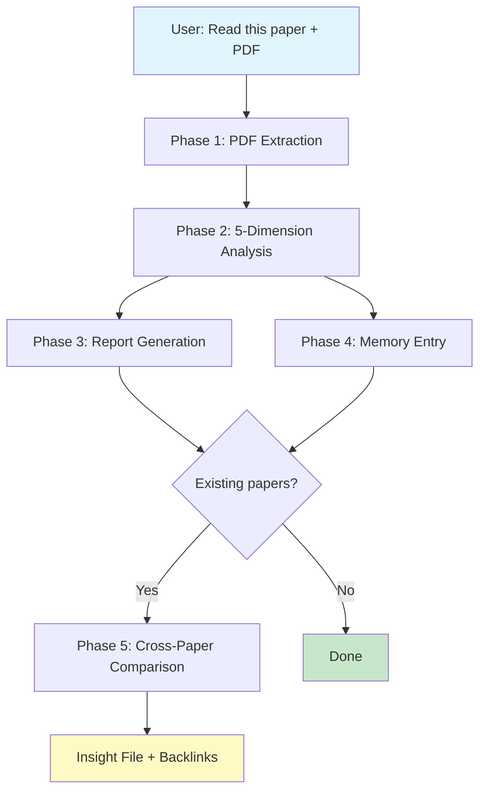

<p align="center">
  <h1 align="center">📖 Deep Read Paper Skill / 论文深度阅读技能</h1>
  <p align="center">
    A <a href="https://claude.ai/claude-code">Claude Code</a> Skill for deep academic paper reading with persistent knowledge management.
    <br/>
    <strong>Read once. Remember forever. Discover connections.</strong>
    <br/>
    基于 Claude Code 的学术论文深度阅读技能——读一次，记住所有，发现连接。
  </p>
</p>

<p align="center">
  
  
  
  
</p>

---

## What Is This? / 这是什么？

**Deep Read Paper Skill** transforms Claude Code into a **personal AI research assistant** that reads, analyzes, and remembers academic papers. It's not just a PDF summarizer — it's a complete paper knowledge management system.

> **Deep Read Paper Skill** 将 Claude Code 转变为一个**个人 AI 研究助手**，能阅读、分析并记住学术论文。它不仅仅是 PDF 摘要器——而是一套完整的论文知识管理系统。

- 📄 **Read** any academic paper PDF page-by-page (never skips content) — **逐页阅读**论文 PDF，绝不跳过任何内容
- 🧠 **Analyze** across 5 dimensions: problem genealogy, method lineage, intuitive interpretation, experiment design, and limitations — **五维深度分析**：问题溯源、方法溯源、通俗解读、实验分析、局限性
- 📝 **Generate** structured Chinese-language interpretation reports with LaTeX formulas, data tables, and claim-evidence mapping — **生成**含公式、数据表、声明-证据对照的结构化中文解读报告
- 💾 **Remember** in an Obsidian-compatible knowledge vault with YAML frontmatter, wikilinks, and ChromaDB embeddings — **记忆**到 Obsidian 知识库，含 YAML frontmatter、wikilinks 和向量索引
- 🔗 **Connect** papers automatically — discovers methodological, topical, and complementary relationships — **关联**论文，自动发现方法相似/领域相通/互补关系
- 💡 **Innovate** via cross-paper research directions with concrete technical feasibility analysis — **创新**：提出跨论文研究方向，含具体技术可行性分析

> **TL;DR**: Just point to a PDF and say "read this paper." The skill handles everything else. / 只需指一下 PDF 说"读这篇论文"，剩下的一切自动完成。

---

## Why This Exists / 为什么需要这个技能

| Problem / 痛点 | Solution / 解决方案 |
|---------|----------|
| Reading papers is time-consuming; details fade | Structured dual output: detailed report + persistent memory entry |
| 读论文耗时，细节几天就忘 | 结构化双产出：详细解读报告 + 持久记忆条目 |
| Papers exist in isolation; hard to see the bigger picture | Cross-paper linking with Obsidian knowledge graph |
| 论文孤岛，看不到全局脉络 | Obsidian 知识图谱的跨论文关联 |
| LLM summaries are shallow; miss nuance | 5-dimension analysis: problem → methods → experiments → limitations |
| LLM 摘要肤浅，缺少深度 | 五维分析：问题 → 方法 → 实验 → 局限 |
| Knowledge lost between projects | Portable Obsidian vault, independent of Claude Code |
| 换项目就丢知识 | 可移植 Obsidian vault，独立于 Claude Code |
| Can't find that paper from 3 months ago | ChromaDB semantic search + MCP tools |
| 找不到三个月前读的论文 | ChromaDB 语义搜索 + 7 个 MCP 工具 |

---

## How It Works / 工作流程



```
用户："读这篇论文" + PDF
    ↓
Phase 1: PDF 逐页提取（PyMuPDF，不跳过任何一页）
    ↓
Phase 2: 五维深度分析（问题溯源 → 方法溯源 → 通俗解读 → 实验分析 → 局限性）
    ↓
Phase 3: 生成中文解读报告 → Phase 4: 创建结构化记忆条目
    ↓
Phase 5: 如果知识库中有相关论文 → 跨论文对比 + 创新建议 + 洞察文件
```

### The 5 Analysis Dimensions / 五维分析

| # | Dimension / 维度 | Core Questions / 核心问题 |
|---|-----------|------------------------|
| 1 | **Problem Genealogy** 问题溯源 | What problem? Why couldn't prior work solve it? What insight unlocked it? |
| 2 | **Method Genealogy** 方法溯源 | Original or derived? Base methods? How changed and why? |
| 3 | **Intuitive Interpretation** 通俗解读 | Plain-language + analogies. I/O specs. Key formulas explained. |
| 4 | **Experiment Analysis** 实验分析 | Claim-evidence mapping. Baseline rationale. Reproducibility. |
| 5 | **Limitation Analysis** 局限性 | Scope, gaps, improvement directions with technical feasibility. |

---

## Quick Start / 快速开始

### Prerequisites / 前置条件

- **Claude Code** (with skills enabled)
- **Python 3.10+**
- **Obsidian** (optional — for graph visualization / 可选——用于图谱可视化)
- **PyMuPDF** works on Linux/macOS/Windows

### Installation / 安装

```bash
# 1. Clone and install / 克隆并安装
git clone https://github.com/huyang51/deep_read_paper_skill.git
cd deep_read_paper_skill
pip install -r requirements.txt

# 2. Edit ONE file: settings.json (fill in 3 required fields)
#    编辑 settings.json（只需填写 3 个必填项）

# 3. Deploy to your project / 部署到你的项目
python setup.py

# 4. (Optional) Initialize Obsidian vault / (可选) 初始化 Obsidian vault
cp -r vault-template/ /your/knowledge-base/path/

# 5. Restart Claude Code / 重启 Claude Code
```

### Configuration / 配置 (`settings.json`)

```json
{
  "vault_dir": "D:/my-papers/knowledge-base",
  "project_dir": "D:/my-papers",
  "python_cmd": "D:/Anaconda/python.exe",
  "embedding_model": "all-MiniLM-L6-v2"
}
```

| Field / 字段 | Required / 必填 | Description / 说明 |
|-------|----------|-------------|
| `vault_dir` | ✅ | Knowledge base path. Reports, memory entries, and ChromaDB stored here. 知识库路径。报告、记忆条目和向量索引存储于此。 |
| `project_dir` | ✅ | Your Claude Code project root. `setup.py` auto-deploys config. Claude Code 项目根目录，setup.py 自动部署。 |
| `python_cmd` | ✅ | Python interpreter (absolute path recommended on Windows). Python 解释器路径。 |
| `embedding_model` | No | For Chinese papers, use `paraphrase-multilingual-MiniLM-L12-v2`. 中文论文建议换为多语言模型。 |
| `trigger_keywords_cn/en` | No | Customize auto-trigger keywords. 自定义触发关键词。 |

> **Path format**: Forward slashes `/` even on Windows (e.g., `D:/path/to/dir`). Windows 路径请用正斜杠 `/`。
>
> **Environment variable**: Set `PAPER_KB_VAULT_DIR` to override `vault_dir`. 设置环境变量可覆盖 vault_dir。

---

## Usage / 使用方法

### Reading a Paper / 读论文

Just point Claude Code to a PDF / 只需告诉 Claude Code 论文路径：

```
Read this paper: "D:/papers/SayPlan - 2023 - Grounding LLMs using 3D Scene Graphs.pdf"
帮我读一下这篇论文："D:/papers/SayPlan - 2023.pdf"
```

The skill automatically / 技能自动完成：
1. Extracts all pages via PyMuPDF (never skips — even appendices) / 逐页提取（绝不跳过，含附录）
2. Performs 5-dimension deep analysis / 五维深度分析
3. Generates a Chinese interpretation report → `reports/<short_name>_解读报告.md`
4. Creates a structured memory entry → `papers/<short_name>.md`
5. Indexes into ChromaDB for semantic search / 向量化索引
6. Cross-paper comparison if related papers exist / 有相关论文则自动对比

### Searching Your Knowledge Base / 搜索知识库

```
"What papers in my knowledge base are about 3D scene graphs?"
知识库里有什么关于 3D 场景图的论文？
"Compare the SayPlan and EmbodiedRAG papers"
对比一下 SayPlan 和 EmbodiedRAG
```

Available MCP tools / 可用 MCP 工具：

| Tool / 工具 | Description / 说明 |
|------|-------------|
| `paper_search` | Semantic search via ChromaDB (supports Chinese & English) / 语义搜索（支持中英文） |
| `paper_get` | Retrieve full paper details by ID / 按 ID 获取论文完整信息 |
| `paper_find_related` | Find related papers / 查找关联论文 |
| `paper_search_by_method` | Filter by method category / 按方法类别检索 |
| `paper_index_stats` | Knowledge base statistics / 知识库统计信息 |

### Viewing Your Knowledge Graph / 浏览知识图谱

Open the vault directory in Obsidian / 用 Obsidian 打开 vault：
- **Graph View** (`Ctrl+G`): Papers as nodes, arrows show influence flow (old → new) / 图谱视图：论文为节点，箭头表示学术影响流向
- **Dataview**: `index.md` provides a sortable paper table / 动态索引表格

---

## Architecture / 架构

```
deep_read_paper_skill/
├── SKILL.md                     # Skill definition (Claude Code reads this)
├── settings.json                # ⭐ The ONLY file you need to edit / 唯一需编辑的文件
├── setup.py                     # One-click deployment / 一键部署
├── requirements.txt             # Dependencies / 依赖
│
├── mcp_server/                  # MCP Server (ChromaDB + 7 tools)
│   ├── server.py                #   JSON-RPC main loop + tool dispatch
│   ├── chroma_store.py          #   Vector index management 向量索引管理
│   ├── markdown_parser.py       #   YAML frontmatter parser + auto backlinks
│   ├── cross_refs.py            #   Cross-paper relationship discovery 跨论文关联
│   ├── config.py                #   Reads settings.json
│   └── models.py                #   Pydantic I/O models
│
├── hooks/                       # Claude Code Hooks
│   ├── session_start.py         #   Injects recent paper summaries on session start
│   └── user_prompt_submit.py    #   Keyword-triggered search hints 关键词触发检索
│
├── tools/
│   └── index_paper.py           #   CLI paper indexer 命令行索引工具
│
├── vault-template/              # Obsidian vault starter kit / Obsidian 知识库模板
│
├── references/                  # Report & memory templates / 报告和记忆模板
│   ├── report_template.md       #   Chinese interpretation report template 中文解读模板
│   └── memory_entry_template.md
│
└── output/                      # setup.py output (auto-deployed)
```

### Vault Structure / 知识库结构 (Generated User Data)

```
<vault_dir>/
├── papers/          # Structured paper memory (.md with YAML + wikilinks)
├── reports/         # Full Chinese interpretation reports / 中文解读报告
├── insights/        # Cross-paper innovation insights / 跨论文创新见解
├── index.md         # Dataview dynamic index
└── .chromadb/       # Vector database (auto-managed)
```

### Knowledge Graph Conventions / 图谱约定

- **Arrows**: Old paper → New paper (academic influence flow) / 箭头方向 = 学术影响流
- **Forward references**: Use **bold text** in new paper body, NOT wikilinks / 新论文引用旧论文用加粗文本
- **Backlinks**: Auto-created `## 后续引用` section with `[[wikilink]]` / 回链自动创建

---

## Example / 产出示例

This skill has produced knowledge bases covering / 已构建的知识库覆盖：

| Domain / 领域 | Papers / 论文 | Connected Through / 关联方式 |
|--------|--------|-------------------|
| 3D Scene Graph + LLM Planning | SayPlan (CoRL 2023), EmbodiedRAG (2024), Open3DSG (CVPR 2024), Text-Scene (2025), BrainBody-LLM (2025) | 3DSG construction → retrieval → planning full stack |
| Multimodal Retrieval | FLMR, PreFLMR, ReT, UniIR, AgentKB | Late-interaction retrieval paradigm evolution |

Each paper report includes / 每篇论文报告包含：
- **30-second flash card** / 30秒速览卡片
- **Method genealogy table** / 方法溯源表——哪些设计来自哪篇前人工作
- **Claim-evidence mapping** / 声明-证据对照——论文的每个 claim 是否有实验支撑
- **Cross-paper comparison** / 跨论文对比——方法/问题/实验维度差异一览表
- **Innovation proposals** / 创新建议——含具体技术可行性分析

---

## Hooks / 钩子

| Hook | When / 触发时机 | What It Does / 行为 |
|------|------|-------------|
| `SessionStart` | New session / 新会话 | Injects 3 most recent paper summaries / 注入最近 3 篇论文摘要 |
| `UserPromptSubmit` | Every user message / 每次用户消息 | Keyword detection → injects search hints / 关键词检测 → 注入检索提示 |

---

## FAQ

<details>
<summary><b>Q: Obsidian 图谱看不到节点？/ Obsidian graph shows no nodes?</b></summary>

1. Verify Obsidian vault path matches `vault_dir` / 确认 vault 路径正确
2. Graph settings → Ensure "Existing files" is ON / 确保"现有文件"开启
3. Check no path filter excludes `papers/`
</details>

<details>
<summary><b>Q: MCP Server 启动失败？/ won't start?</b></summary>

```bash
# Quick dependency check / 依赖检查
python -c "import chromadb, watchfiles, frontmatter, pydantic; print('OK')"

# Manual test / 手动测试
cd deep_read_paper_skill
echo '{"jsonrpc":"2.0","id":1,"method":"initialize","params":{}}' | python -m mcp_server
```
</details>

<details>
<summary><b>Q: 中文搜索结果不准确？/ Chinese search poor?</b></summary>

Switch `embedding_model` to `paraphrase-multilingual-MiniLM-L12-v2` in `settings.json`. Re-index after change. / 切换 embedding_model 后需重建索引。
</details>

<details>
<summary><b>Q: PDF 文字提取失败（扫描版 PDF）？</b></summary>

PyMuPDF cannot handle image-based PDFs. Use OCR tools (e.g., Tesseract) first. / 扫描版 PDF 需先用 OCR 工具预处理。
</details>

<details>
<summary><b>Q: 多台机器如何共享？/ Multi-machine setup?</b></summary>

1. Copy skill folder to each machine / 复制文件夹
2. Update `settings.json` paths / 更新路径
3. Run `python setup.py`
4. Sync vault with Git or shared drive / 用 Git 同步 vault
</details>

---

## Dependencies / 依赖

| Package | Version | Purpose / 用途 |
|---------|---------|-----|
| `chromadb` | ≥0.4 | Vector store for semantic search / 语义搜索向量库 |
| `python-frontmatter` | ≥1.0 | YAML frontmatter parsing |
| `pydantic` | ≥2.0 | MCP tool schema validation |
| `watchfiles` | ≥0.20 | Auto-index new/updated papers / 文件变化自动索引 |
| `PyMuPDF` | ≥1.23 | PDF text extraction (used by Claude Code) / PDF 文本提取 |

All pure Python. Clean install on Linux, macOS, and Windows. / 全纯 Python，跨平台兼容。

---

## Contributing / 贡献

Areas open for improvement / 欢迎贡献的方向：

- **Better PDF handling**: 2-column papers, scanned PDF fallback / 更好的 PDF 解析
- **Additional languages**: Report templates in English, Japanese / 更多语言的报告模板
- **New MCP tools**: Citation graph export, BibTeX generation / 新 MCP 工具
- **LLM backend flexibility**: Models beyond Claude / 支持更多 LLM

Please open an issue before submitting significant PRs. / 重大变更前请先提 issue。

---

## License

MIT — see [LICENSE](LICENSE) for details.

---

## Acknowledgments / 致谢

- **Obsidian** — Graph-based knowledge management / 图谱式知识管理
- **ChromaDB** — Lightweight local vector search / 轻量级本地向量检索
- **PyMuPDF** — Reliable PDF text extraction / 可靠 PDF 提取
- Built for and powered by **Claude Code**

---

<p align="center">
  <sub>Made with ❤️ for researchers who read too many papers and remember too few.<br/>
  致读了太多论文、记住了太少的研究者们。</sub>
</p>
