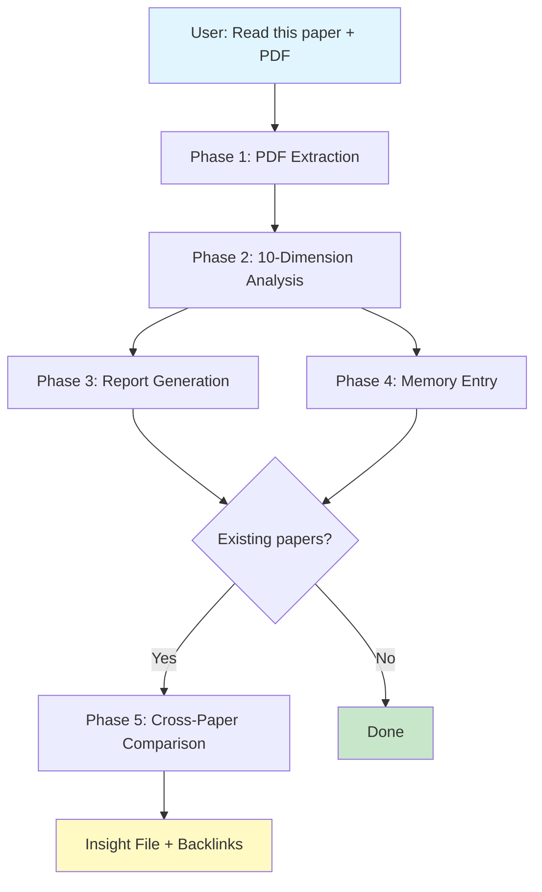

<p align="center">
  <h1 align="center">📖 Deep Read Paper Skill</h1>
  <p align="center">
    A <a href="https://claude.ai/claude-code">Claude Code</a> Skill for deep academic paper reading with persistent knowledge management.
    <br/>
    <strong>Read once. Remember forever. Discover connections.</strong>
  </p>
</p>

<p align="center">
English | <a href="README_CN.md">简体中文</a>
<br/><br/>


</p>

---

## What Is This?

**Deep Read Paper Skill** transforms Claude Code into a **personal AI research assistant** that reads, analyzes, and remembers academic papers. It's not just a PDF summarizer — it's a complete paper knowledge management system:

- 📄 **Read** any academic paper PDF page-by-page (never skips content)
- 🧠 **Analyze** across 10 dimensions: 5 reader-side (problem genealogy, method lineage, intuitive interpretation, experiment design, limitations) + 3 reviewer-side (novelty audit, failure cases, rejection risk) + 2 deep-understanding (counterfactual verification, implicit assumptions audit)
- 📝 **Generate** structured interpretation reports with LaTeX formulas, data tables, and claim-evidence mapping
- 💾 **Remember** in an Obsidian-compatible knowledge vault with YAML frontmatter, wikilinks, and ChromaDB embeddings
- 🔗 **Connect** papers automatically — discovers methodological, topical, and complementary relationships
- 💡 **Innovate** via cross-paper research directions with concrete technical feasibility analysis

> **TL;DR**: Point to a PDF and say "read this paper." Everything else happens automatically.

---

## Why This Exists

| Problem | Solution |
|---------|----------|
| Reading papers is time-consuming; details fade | Structured dual output: detailed report + persistent memory entry |
| Papers exist in isolation; hard to see the bigger picture | Cross-paper linking with Obsidian knowledge graph |
| LLM summaries are shallow; miss nuance | 10-dimension analysis: 5 reader-side + 3 reviewer-side + 2 deep-understanding |
| Knowledge lost between projects | Portable Obsidian vault, independent of Claude Code |
| Can't find that paper from 3 months ago | ChromaDB semantic search + MCP tools |

---

## How It Works



### The 10 Analysis Dimensions

| # | Category | Dimension | Core Questions Answered |
|---|----------|-----------|------------------------|
| 1 | Reader-side | **Problem Genealogy** | What problem? Why couldn't prior work solve it? What insight unlocked the solution? |
| 2 | Reader-side | **Method Genealogy** | Original or derived? Base methods? How changed and why? Technical difficulty? |
| 3 | Reader-side | **Intuitive Interpretation** | Plain-language + analogies. I/O specs. Key formulas explained. |
| 4 | Reader-side | **Experiment Analysis** | Claim-evidence mapping. Baseline rationale. Reproducibility assessment. |
| 5 | Reader-side | **Limitation Analysis** | Method scope, experiment gaps, author honesty. Improvement directions. |
| 6 | Reviewer-side | **Novelty Audit** | Incremental / substantial / breakthrough? Claim-vs-essence alignment? Position vs concurrent work? |
| 7 | Reviewer-side | **Failure Cases & Boundary** | What core assumptions? What failure modes authors didn't show? Cross-domain gaps? |
| 8 | Reviewer-side | **Rejection Risk** | What would reviewers cite as reject reasons? Top-3 severity-ranked rebuttable points? |
| 9 | Deep Understanding | **Counterfactual Verification** | Under what conditions does each core claim break? Data/scale/baseline substitution? |
| 10 | Deep Understanding | **Implicit Assumptions Audit** | What hidden assumptions (data / evaluation / engineering) does the paper rely on? Verified or not? |

---

## Quick Start

### Prerequisites

- **Claude Code** (with skills enabled)
- **Python 3.10+**
- **Obsidian** (optional — for graph visualization)
- **PyMuPDF** works on Linux/macOS/Windows

### Installation

```bash
# 1. Clone and install
git clone https://github.com/huyang51/deep_read_paper_skill.git
cd deep_read_paper_skill
pip install -r requirements.txt

# 2. Edit ONE file: settings.json
# Fill in vault_dir, project_dir, python_cmd (3 required fields)

# 3. Deploy to your project
python setup.py

# 4. (Optional) Initialize Obsidian vault
cp -r vault-template/ /your/knowledge-base/path/

# 5. Restart Claude Code
```

### Configuration (`settings.json`)

```json
{
  "vault_dir": "D:/my-papers/knowledge-base",
  "project_dir": "D:/my-papers",
  "python_cmd": "D:/Anaconda/python.exe",
  "embedding_model": "all-MiniLM-L6-v2"
}
```

| Field | Required | Description |
|-------|----------|-------------|
| `vault_dir` | ✅ | Where reports, memory entries, and ChromaDB index are stored |
| `project_dir` | ✅ | Your Claude Code project root — `setup.py` auto-deploys config here |
| `python_cmd` | ✅ | Python interpreter path (absolute recommended on Windows) |
| `embedding_model` | No | For Chinese papers, use `paraphrase-multilingual-MiniLM-L12-v2` |
| `trigger_keywords_cn/en` | No | Customize auto-trigger keywords (defaults cover common patterns) |

> **Path format**: Use forward slashes `/` even on Windows (e.g., `D:/path/to/dir`).
>
> **Environment variable override**: Set `PAPER_KB_VAULT_DIR` to override `vault_dir`. Useful when sharing one skill installation across multiple projects.

---

## Usage

### Reading a Paper

Point Claude Code to a PDF:

```
Read this paper: "D:/papers/SayPlan - 2023 - Grounding LLMs using 3D Scene Graphs.pdf"
```

The skill automatically:
1. Extracts all pages via PyMuPDF (never skips — even appendices)
2. Performs 10-dimension deep analysis
3. Generates a Chinese interpretation report → `reports/<short_name>_解读报告.md`
4. Creates a structured memory entry → `papers/<short_name>.md`
5. Indexes into ChromaDB for semantic search
6. Runs cross-paper comparison and creates insight files (if related papers exist)

### Searching Your Knowledge Base

Ask Claude Code directly:

```
"What papers in my knowledge base are about 3D scene graphs?"
"Search for papers related to retrieval-augmented generation"
"Compare the SayPlan and EmbodiedRAG papers"
```

| Tool | Description |
|------|-------------|
| `paper_search` | Semantic search via ChromaDB (supports Chinese & English) |
| `paper_get` | Retrieve full paper details by ID |
| `paper_find_related` | Find papers with methodological/topical/complementary relationships |
| `paper_search_by_method` | Filter by method category |
| `paper_index_stats` | Knowledge base statistics |

### Viewing Your Knowledge Graph

Open the vault directory in Obsidian:
- **Graph View** (`Ctrl+G`): Papers as nodes, arrows show academic influence (old → new)
- **Dataview**: `index.md` provides a dynamic sortable table of all papers

---

## Architecture

```
deep_read_paper_skill/
├── SKILL.md                     # Skill definition (Claude Code reads this)
├── settings.json                # ⭐ The ONLY file you need to edit
├── setup.py                     # One-click deployment
├── requirements.txt             # Dependencies (chromadb, pymupdf, watchfiles, pydantic)
│
├── mcp_server/                  # MCP Server (ChromaDB + 7 tools)
│   ├── server.py                #   JSON-RPC main loop + tool dispatch
│   ├── chroma_store.py          #   Vector index (create, search, update, delete)
│   ├── markdown_parser.py       #   YAML frontmatter parser + auto backlinks
│   ├── cross_refs.py            #   Cross-paper relationship discovery
│   ├── config.py                #   Reads settings.json
│   └── models.py                #   Pydantic I/O models
│
├── hooks/                       # Claude Code Hooks
│   ├── session_start.py         #   Injects recent paper summaries on session start
│   └── user_prompt_submit.py    #   Keyword-triggered search hints
│
├── tools/
│   └── index_paper.py           #   CLI paper indexer
│
├── vault-template/              # Obsidian vault starter kit
│   ├── .obsidian/               #   Graph + properties + Dataview config
│   ├── index.md                 #   Dataview-powered dynamic index
│   └── templates/               #   Paper memory & insight templates
│
├── references/                  # Report & memory entry templates
│   ├── report_template.md
│   └── memory_entry_template.md
│
└── output/                      # setup.py output (auto-deployed)
```

### Vault Structure (Generated User Data)

```
<vault_dir>/
├── papers/          # Structured paper memory (.md with YAML + wikilinks)
├── reports/         # Full Chinese interpretation reports
├── insights/        # Cross-paper innovation insights (auto-generated)
├── index.md         # Dataview dynamic index
└── .chromadb/       # Vector database (auto-managed)
```

### Knowledge Graph Conventions

- **Arrows**: Old paper → New paper (academic influence flow)
- **Forward references** (new paper body): **Bold text** (`**SayPlan**`), NOT wikilinks — prevents reverse edges
- **Backlinks** (old paper body): System auto-creates `## 后续引用` section with `[[wikilink]]`
- **Unindexed papers**: Also use bold text — prevents ghost nodes

---

## Example Outputs

This skill has produced knowledge bases covering:

| Domain | Papers | Connected Through |
|--------|--------|-------------------|
| 3D Scene Graph + LLM Planning | SayPlan (CoRL 2023), EmbodiedRAG (2024), Open3DSG (CVPR 2024), Text-Scene (2025), BrainBody-LLM (2025) | 3DSG construction → retrieval → planning full stack |
| Multimodal Retrieval | FLMR, PreFLMR, ReT, UniIR, AgentKB | Late-interaction retrieval paradigm evolution |

Each paper report includes:
- A **30-second flash card** at the top
- **Method genealogy table** tracing components to prior work
- **Claim-evidence mapping** — every claim checked against experimental support
- **Cross-paper comparison** in a single table
- **Innovation proposals** with feasibility analysis

---

## Hooks

| Hook | When | What It Does |
|------|------|-------------|
| `SessionStart` | New session | Injects 3 most recent paper summaries |
| `UserPromptSubmit` | Every user message | Keyword detection → injects search hints |

Trigger keywords are customizable in `settings.json`.

---

## FAQ

<details>
<summary><b>Q: Obsidian graph shows no nodes?</b></summary>

1. Verify Obsidian vault path matches `vault_dir`
2. Graph settings → Ensure "Existing files" is ON
3. Check no path filter excludes `papers/`
</details>

<details>
<summary><b>Q: MCP Server won't start?</b></summary>

```bash
# Quick dependency check
python -c "import chromadb, watchfiles, frontmatter, pydantic; print('OK')"

# Manual test
cd deep_read_paper_skill
echo '{"jsonrpc":"2.0","id":1,"method":"initialize","params":{}}' | python -m mcp_server
```
</details>

<details>
<summary><b>Q: Chinese search results are poor?</b></summary>

The default embedding model (`all-MiniLM-L6-v2`) is optimized for English. Switch to `paraphrase-multilingual-MiniLM-L12-v2` in `settings.json`. Re-index after the change.
</details>

<details>
<summary><b>Q: PDF text extraction fails (scanned PDF)?</b></summary>

PyMuPDF cannot extract text from image-based PDFs. Pre-process with OCR tools (e.g., Tesseract) first.
</details>

<details>
<summary><b>Q: How do I use this across multiple machines?</b></summary>

1. Copy the skill folder to each machine
2. Update `settings.json` paths
3. Run `python setup.py`
4. Sync the vault directory with Git or a shared drive
</details>

<details>
<summary><b>Q: Can I customize the analysis dimensions?</b></summary>

Yes — modify the workflow in `SKILL.md`. Update the report template in `references/report_template.md` accordingly.
</details>

---

## Dependencies

| Package | Version | Purpose |
|---------|---------|-----|
| `chromadb` | ≥0.4 | Semantic search vector store |
| `python-frontmatter` | ≥1.0 | YAML frontmatter parsing |
| `pydantic` | ≥2.0 | MCP tool schema validation |
| `watchfiles` | ≥0.20 | Auto-index on file changes |
| `PyMuPDF` | ≥1.23 | PDF text extraction (used by Claude Code) |

All pure Python — clean install on Linux, macOS, Windows.

---

## Contributing

Areas open for improvement:

- **Better PDF handling**: 2-column papers, scanned PDF fallback, OCR integration
- **Additional languages**: Report templates in English, Japanese, etc.
- **New MCP tools**: Citation graph export, BibTeX generation
- **LLM backend flexibility**: Models beyond Claude

Please open an issue before submitting significant PRs.

---

## License

MIT — see [LICENSE](LICENSE) for details.

---

## Acknowledgments

- **Obsidian** — Graph-based knowledge management
- **ChromaDB** — Lightweight local vector search
- **PyMuPDF** — Reliable PDF text extraction
- Built for and powered by **Claude Code**

---

<p align="center">
  <sub>Made with ❤️ for researchers who read too many papers and remember too few.</sub>
</p>
