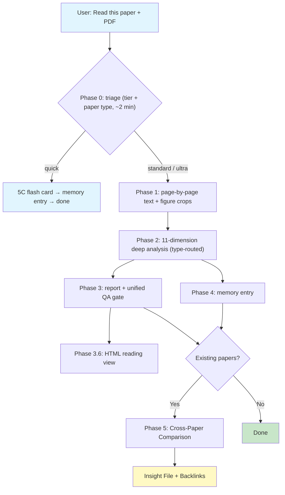

<p align="center">
  <h1 align="center">📖 Deep Read Paper Skill</h1>
  <p align="center">
    A <a href="https://claude.ai/claude-code">Claude Code</a> Skill for deep academic paper reading with persistent knowledge management.
    <br/>
    <strong>Read once. Remember forever. Discover connections.</strong>
  </p>
</p>

<p align="center">
English | <a href="README_CN.md">简体中文</a>
<br/><br/>


</p>

---

## What Is This?

**Deep Read Paper Skill** transforms Claude Code into a **personal AI research assistant** that reads, analyzes, and remembers academic papers. It's not just a PDF summarizer — it's a complete paper knowledge management system:

- 🎚️ **Triage** every paper in ~2 minutes (Keshav pass-1 style) into quick / standard / ultra — standard reads the whole paper in one full-context pass (1M-token windows make multi-agent fan-out unnecessary for normal papers) behind a single fresh-eyes QA gate; only 60+ page reports/surveys get the 3-agent orchestrated tier with cross-view contradiction arbitration
- 📄 **Read** any academic paper PDF page-by-page (never skips content)
- 🔒 **Private by default** — the whole reading pipeline runs locally: PDF parsing, figure cropping, the embedding index, the vault. Your papers never leave your machine. The only outbound calls are the optional citation checks (`cite_verify` / `paper_citations` / `tools/verify_refs.py`), which hit OpenAlex / Semantic Scholar **without any API key**; skip them and nothing connects at all — no account, no key, no telemetry anywhere in the skill
- 🖼️ **See** the figures — the text channel (page-by-page) and a visual channel (geometry-cropped figures, vision-checked, embedded in reports) work together
- 🖥️ **Share** every finished report as a standalone HTML reading view — KaTeX math with a three-tier delivery (CDN multi-mirror → single-file offline embed → plain LaTeX source), booktabs tables, sticky TOC with active-section highlight, click-to-zoom figures, dark/light themes, print-ready — deterministic from the Markdown, never hand-written
- 🧠 **Analyze** across 11 dimensions: 5 reader-side (problem genealogy, method lineage, intuitive interpretation, experiment design, limitations) + 3 reviewer-side (novelty audit, failure cases, rejection risk) + 3 deep-understanding (counterfactual verification, implicit assumptions audit, **synthesis judgment**)
- 🧭 **Route by paper type** — method / theory / survey / benchmark / system / report — before the analysis runs: theory papers get a proof-structure audit (assumption necessity, proof completeness), surveys a coverage-audit and taxonomy-axis critique, datasets an annotation-consistency and leakage audit, systems a measurement-fairness audit. A per-type section-replacement table also swaps what each report section *contains* (surveys get taxonomy audits where methods get tensor-shape tables; theory walks a proof instead of an input→output pipeline) — questions follow the routing table, section carriers follow the replacement table. Type never reduces how many dimensions run, and never relaxes the every-page-read rule
- 📝 **Generate** structured interpretation reports with LaTeX formulas, data tables, and claim-evidence mapping
- 💾 **Remember** in an Obsidian-compatible knowledge vault with YAML frontmatter, wikilinks, and ChromaDB embeddings
- 🔗 **Connect** papers with declared semantics — every relation carries a type (method-similar / problem-related / complementary / evolutionary) and a direction (predecessor / successor / peer) in frontmatter. The reciprocal entry, the `related_papers` projection and the Obsidian graph edge are all derived from that declaration, so arrow direction follows the data instead of the order you happened to read the papers in
- ✅ **Verify** claims about other papers against OpenAlex/Semantic Scholar (`cite_verify`), and reports posterior impact via citation data (`paper_citations`). Before the report is finalized, `tools/verify_refs.py` runs an **existence gate** over every externally named work and appends a verification ledger to §6 — with a hard honesty rule: *not indexed ≠ does not exist*, so a missing record is never rendered as "fabricated"
- 📊 **Audit** every comparative numeric claim into a §3.7 statistical-rigor ledger — repeats/seeds, significance test and its unit, Δ vs. reported variance, selection space. Gaps are marked `[not reported]` and treated as **disclosure gaps only**: "not reported" never becomes "not done", "insignificant" or "irreproducible"
- 💡 **Innovate** via cross-paper research directions with concrete technical feasibility analysis

> **TL;DR**: Point to a PDF and say "read this paper." Everything else happens automatically.

---

## Why This Exists

| Problem | Solution |
|---------|----------|
| Reading papers is time-consuming; details fade | Structured dual output: detailed report + persistent memory entry |
| Papers exist in isolation; hard to see the bigger picture | Cross-paper linking with Obsidian knowledge graph |
| LLM summaries are shallow; miss nuance | 11-dimension analysis: 5 reader-side + 3 reviewer-side + 3 deep-understanding, routed by paper type (theory / survey / benchmark / system each get their own questions *and* section formats) |
| Knowledge lost between projects | Portable Obsidian vault, independent of Claude Code |
| Can't find that paper from 3 months ago | ChromaDB semantic search + 9 MCP tools (incl. external citation checks) |

---

## How It Works


```mermaid
graph TD
    A["User: Read this paper + PDF"] --> T{"Phase 0: triage (tier + paper type, ~2 min)"}
    T -->|"quick"| Q["5C flash card → memory entry → done"]
    T -->|"standard / ultra"| B["Phase 1: page-by-page text + figure crops"]
    B --> C["Phase 2: 11-dimension deep analysis (type-routed)"]
    C --> D["Phase 3: report + unified QA gate"]
    C --> E["Phase 4: memory entry"]
    D --> R["Phase 3.6: HTML reading view"]
    D --> F{"Existing papers?"}
    E --> F
    F -->|"Yes"| G["Phase 5: Cross-Paper Comparison"]
    F -->|"No"| H["Done"]
    G --> I["Insight File + Backlinks"]

    style A fill:#e1f5fe
    style Q fill:#e1f5fe
    style H fill:#c8e6c9
    style I fill:#fff9c4
```

### The 11 Analysis Dimensions

| # | Category | Dimension | Core Questions Answered |
|---|----------|-----------|------------------------|
| 1 | Reader-side | **Problem Genealogy** | What problem? Why couldn't prior work solve it? What insight unlocked the solution? |
| 2 | Reader-side | **Method Genealogy** | Original or derived? Base methods? How changed and why? Technical difficulty? |
| 3 | Reader-side | **Intuitive Interpretation** | Plain-language + analogies. I/O specs. Key formulas explained. |
| 4 | Reader-side | **Experiment Analysis** | Claim-evidence mapping. Baseline rationale. Reproducibility assessment. |
| 5 | Reader-side | **Limitation Analysis** | Method scope, experiment gaps, author honesty. Improvement directions. |
| 6 | Reviewer-side | **Novelty Audit** | Incremental / substantial / breakthrough? Claim-vs-essence alignment? Position vs concurrent work? |
| 7 | Reviewer-side | **Failure Cases & Boundary** | What core assumptions? What failure modes authors didn't show? Cross-domain gaps? |
| 8 | Reviewer-side | **Rejection Risk** | What would reviewers cite as reject reasons? Top-3 severity-ranked rebuttable points? |
| 9 | Deep Understanding | **Counterfactual Verification** | Under what conditions does each core claim break? Data/scale/baseline substitution? |
| 10 | Deep Understanding | **Implicit Assumptions Audit** | What hidden assumptions (data / evaluation / engineering) does the paper rely on? Verified or not? |
| 11 | Deep Understanding | **Synthesis Judgment** | Synthesize all findings into an actionable "next-step map" — where to start if building on this work? |

> **Type-routed**: before analysis, the paper is classified (method / theory / survey / benchmark / system / report) and each dimension's question is re-pointed accordingly — for a theory paper "experiment design" becomes a **proof-structure audit** (assumption necessity, proof completeness) and "ablation" becomes assumption-relaxation analysis; for a survey "method genealogy" becomes **lineage reconstruction** and "experiment design" becomes a **coverage audit** (search protocol, whether the taxonomy axes are MECE); dataset papers get an annotation-consistency and leakage audit, systems papers a measurement-fairness audit. Type changes *what* each dimension asks — never how many dimensions run, and never whether every page gets read (see `SKILL.md` Phase 2).

---

## Quick Start

### Requirements

| Item | Requirement | Notes |
|------|-------------|-------|
| **Python** | **3.9+** | Matches `requires-python` in `pyproject.toml`; the code deliberately avoids 3.10-only syntax |
| **Conda** (Anaconda / Miniconda) | any | The skill **requires its own environment** (named `paper-kb` below) — not base, not a shared project env |
| **Disk** | ~3 GB (or ~1 GB with `--light`) | CPU build of torch + embedding model + dependencies; `bootstrap.py --light` skips torch/sentence-transformers entirely (see below) |
| **Network** | Model download on first run | The default embedder `paraphrase-multilingual-MiniLM-L12-v2` is ~470 MB and comes from HuggingFace. Behind a slow/blocked connection register with `python deploy.py --register --hf-endpoint https://hf-mirror.com` (the model is downloaded by the *server process* — an export in your shell never reaches it), or the first index call hangs |
| **Claude Code** | with skills enabled | and this repo inside a skills discovery path (`~/.claude/skills/` etc.) — see Installation step 0 |
| **Obsidian** | optional | Only for graph visualization |

> One source of truth for dependencies: **`requirements.txt`** at the repo root — what is installed and why is explained there.

### Installation

> **⚠️ Step 0, the one that decides success**: the repo must live inside a Claude Code skills discovery path —
> personal `~/.claude/skills/deep_read_paper_skill` (Windows: `%USERPROFILE%\.claude\skills\deep_read_paper_skill`), or project `<project>/.claude/skills/deep_read_paper_skill`.
> Cloned anywhere else, all 7 steps below complete "successfully" and the skill **still never triggers** — the trigger words can't find SKILL.md, and nothing reports an error. `deploy.py` checks this at the end and prints a notice if you got it wrong.

**One command (recommended)** — with any Python ≥3.9 and conda on PATH:

```bash
# Clone straight into the skills directory (personal — available in every project)
git clone https://github.com/huyang51/deep_read_paper_skill.git ~/.claude/skills/deep_read_paper_skill
cd ~/.claude/skills/deep_read_paper_skill
python bootstrap.py --vault D:/papers/knowledge-base --register
```

`bootstrap.py` checks the running interpreter, creates/uses the `paper-kb` conda env and installs `requirements.txt` into it when anything is missing, writes `settings.json` with that interpreter's absolute path (so `python_cmd` cannot point at the wrong Python), seeds the vault from `vault-template/` when the target does not exist, then hands off to `deploy.py` for the preflight and registration. An existing `settings.json` is kept unless `--force` (it is backed up first); the interpreter is asked interactively unless `--yes` takes the defaults. See `python bootstrap.py --help` for every flag. **Tight on disk or bandwidth?** Add `--light`: it skips torch/sentence-transformers (~2 GB saved) and embeds via ChromaDB's built-in ONNX model (`all-MiniLM-L6-v2` — English-first, noticeably weaker Chinese semantics; changing the model changes the vector space, so any existing `.chromadb` index must be rebuilt).

The step-by-step path below does exactly the same things by hand:

```bash
# 1. Clone the repository — MUST be inside a skills directory, or the skill
#    never triggers (see Step 0 above)
git clone https://github.com/huyang51/deep_read_paper_skill.git ~/.claude/skills/deep_read_paper_skill
cd ~/.claude/skills/deep_read_paper_skill
#    Windows (cmd/PowerShell: replace ~ with %USERPROFILE%):
#    git clone https://github.com/huyang51/deep_read_paper_skill.git "%USERPROFILE%\.claude\skills\deep_read_paper_skill"

# 2. Create and activate the skill's own Conda environment (ONCE per machine)
conda create -n paper-kb python=3.10 -y
conda activate paper-kb

# 3. Install dependencies into the ACTIVATED env
#    PYTHONNOUSERSITE=1 is not optional: pip treats packages already present in
#    the user site as satisfied and skips them, leaving an env that breaks with
#    ModuleNotFoundError the moment user site is disabled.
#    (Windows PowerShell:  $env:PYTHONNOUSERSITE=1; python -m pip install -r requirements.txt)
PYTHONNOUSERSITE=1 python -m pip install -r requirements.txt
#    (`pip install -e .` is equivalent — it reads requirements.txt too)

# 4. Create + edit ONE file: settings.json
cp settings.example.json settings.json
# Fill in vault_dir, project_dir, python_cmd (3 required fields)
# - vault_dir:   where to store reports and memory entries
# - project_dir: your Claude Code project root
# - python_cmd:  ABSOLUTE path to the env from step 2, e.g.
#                - Linux/Mac:  "$(conda info --base)/envs/paper-kb/bin/python"
#                - Windows:    "%USERPROFILE%\anaconda3\envs\paper-kb\python.exe"
#                Run `which python` (Linux/Mac) or `where python` (Windows)
#                inside the activated env to confirm the path.

# 5. Deploy (still inside the env)
python deploy.py --register    # or: paper-kb-deploy --register
# This probes python_cmd and prints [WARN] if the interpreter cannot start the
# server — that warning means the config it just wrote would be dead. Don't skip it.
#
# --register adds the MCP server at USER scope (registered once, available from
# every directory, no /mcp approval). Without it the command is only printed for
# you to paste yourself. Hooks stay project-scoped, in
# <project_dir>/.claude/settings.json.

# 6. (Optional) Initialize Obsidian vault
cp -r vault-template/ /your/knowledge-base/path/

# 7. Restart Claude Code
```

> **Why `--register` (user scope) instead of a project `.mcp.json`?**
> A project-scoped `.mcp.json` is a file in a repository, so Claude Code requires you to **approve it once** before anything is launched — that is the boundary that stops "clone a repo" from meaning "run its commands", and the docs are explicit: **"a cloned repository can't approve its own servers."** No skill can approve itself. Until it is approved, **not one tool gets registered**, and the symptom is "those tools don't exist" with no error at all.
> User scope is added by *your own* `claude mcp add`; that action is the approval, so there is nothing left to confirm with `/mcp`.

> **🔑 How the skill is run: everything goes through that one environment**
> - **Tool commands you type in a session** (`python tools/migrate_relations.py`, `python tools/verify_graph_arrows.py`, `python tools/index_paper.py`, …) hit whichever `python` is on PATH — so **`conda activate paper-kb` first**, otherwise they land on system Python and die with `ModuleNotFoundError`.
> - **The MCP server and both hooks need no activation**: `deploy.py` bakes the absolute `python_cmd` path into the user-scope registration and into `.claude/settings.json`.
> - **The first index-backed tool call downloads the embedding model** (~470 MB, see the table). The download happens *after* the MCP handshake — the server connects instantly instead of dying in the client's connect timeout. That one call is slow; once the model is on disk nothing touches the network again.

> **💡 Why a Conda environment**:
> - Isolates `chromadb` / `torch` / `sentence-transformers` / `PyMuPDF` from your system Python and other projects
> - Upgrading or uninstalling the skill never affects anything else
> - Reproducible across machines: one `pip install -r requirements.txt`

> **Common pitfalls**:
> - Repo not inside `~/.claude/skills/` → everything installs cleanly but the skill never triggers, with no error anywhere (`deploy.py` checks this at the end)
> - Forgot `conda activate paper-kb` → `pip install` lands in another Python, or tool commands hit system Python and fail with `ModuleNotFoundError`
> - `python_cmd` points to system Python instead of the skill's env → MCP server and hooks die at startup (deploy's preflight prints `[WARN]`)
> - Left a template value untouched in `settings.json` → `deploy.py` now refuses with `[ERROR]` when `vault_dir` / `project_dir` / `python_cmd` still equal the `settings.example.json` placeholders (the `python_cmd` placeholder used to register a "successful" MCP server that died at first launch — 2026-10-04 deploy audit)
> - No `HF_ENDPOINT` set → the first model download stalls and a starting MCP server looks dead. Once the model is cached this step is gone for good: the server switches itself to offline loading and skips the HuggingFace hub check
> - `conda run -n paper-kb python …` on a path containing Chinese/special characters → **conda's own** report pipe crashes (`UnicodeEncodeError: 'gbk' …`), which looks like a skill failure but isn't (live case 2026-10-04). Activate the env and call `python …` directly, or keep the report path ASCII — the skill's own entry points all force UTF-8 output
> - A large `verify_refs.py` batch answers `429` from row ~50 onward → OpenAlex's free one-time IP credits are spent (S2's keyless pool usually thins out at the same moment). The tool now trips a **circuit breaker** (stops querying after 3 consecutive 429s, keeps the rows visible as 🌐 with Retry-After). Do not re-run the whole batch: `python tools/verify_refs.py --refs refs.txt --out ledger.json --md table.md --resume` after the window resets — already-judged rows are carried over without spending quota; report-side, those rows stay 【外部核验不可用】, never "nonexistent"

### Configuration (`settings.json`)

```json
{
  "vault_dir": "D:/my-papers/knowledge-base",
  "project_dir": "D:/my-papers",
  "python_cmd": "D:/Anaconda3/envs/paper-kb/python.exe",
  "embedding_model": "paraphrase-multilingual-MiniLM-L12-v2",
  "trigger_keywords_cn": ["论文", "文献", "paper", "paper reading", "深度阅读", "论文解读", "论文分析", "读论文"],
  "trigger_keywords_en": ["paper", "literature", "deep read", "paper reading", "paper analysis"]
}
```

| Field | Required | Description |
|-------|----------|-------------|
| `vault_dir` | ✅ | Where reports, memory entries, and ChromaDB index are stored |
| `project_dir` | ✅ | Your Claude Code project root — `paper-kb-deploy` auto-deploys config here |
| `python_cmd` | ✅ | **Absolute path to the conda env's python** (e.g. `D:/Anaconda3/envs/paper-kb/python.exe` on Windows, `/opt/anaconda3/envs/paper-kb/bin/python` on Linux/Mac). Run `which python` inside the activated env to confirm. |
| `embedding_model` | No | **Default: `paraphrase-multilingual-MiniLM-L12-v2`** (Chinese + English; goes through SentenceTransformer → **needs torch**, and the model is downloaded on first use). Without torch, use `all-MiniLM-L6-v2` — ChromaDB's built-in ONNX embedder, no torch and no download, at the cost of weaker Chinese semantic search. **Changing the model changes the vector space**: vectors already in `.chromadb` are not comparable to the new model's, so the index must be rebuilt. `deploy.py` probes `python_cmd` and warns if the interpreter cannot start the server. |
| `openalex_mailto` | No | Email for OpenAlex's polite pool. Optional but recommended — but know what it does and does not buy you: it prioritizes requests, it does **not** refill the free tier's *one-time per-IP credit budget* (~a hundred lookups, live-observed 2026-10-04). Big §6 existence batches are meant to be split across days; `verify_refs.py --resume` finishes an interrupted pass without requering judged rows |
| `trigger_keywords_cn` | No | Chinese keywords that auto-trigger paper-related search hints (UserPromptSubmit hook) |
| `trigger_keywords_en` | No | English keywords that auto-trigger paper-related search hints (UserPromptSubmit hook) |

> **Path format**: Use forward slashes `/` even on Windows (e.g., `D:/path/to/dir`).
>
> **Environment variable override**: Set `PAPER_KB_VAULT_DIR` to override `vault_dir`. Useful when sharing one skill installation across multiple projects.

### What Lives Where (tuning the behavior)

| You want to change… | Edit |
|---------------------|------|
| Workflow phases, triage tiers, QA gates | `SKILL.md` |
| What each of the 11 dimensions asks, its output format, type-routing table, the 🌐/📊 hard checks | `references/dimensions.md` (single source; `SKILL.md` Phase 2 keeps only the overview + mapping table) |
| Report structure and section numbers | `references/report_template.md` — keep its "structures the renderer recognizes" section in sync, that's what the HTML renderer parses |
| How the report *looks* in HTML (palette, typography, TOC/zoom/theme) | `tools/render_report.py` |
| Vault paper-file schema, relation rules, graph sync | `mcp_server/` (`markdown_parser.py`, `relations.py`) |
| MCP tool schemas/behavior | `mcp_server/server.py` (keep `TOOLS` in sync with the Pydantic models) |
| Obsidian side (templates, Dataview, graph config) | `vault-template/` (seeded to a new vault by `bootstrap.py --seed-obsidian`; an existing vault is **not** auto-updated — additive only) |
| Prompt-trigger keywords, vault path, embedding model | `settings.json` (see above) |
| Hook-injected context | `hooks/user_prompt_submit.py`, `hooks/session_start.py` |

---

## Usage

### Reading a Paper

Point Claude Code to a PDF:

```
Read this paper: "D:/papers/SayPlan - 2023 - Grounding LLMs using 3D Scene Graphs.pdf"
```

The skill automatically:
1. Triages the paper (~2 min, Keshav pass-1) into quick / standard / ultra — quick stops at a 5C flash card, standard is the default
2. Extracts all pages via PyMuPDF (never skips — even appendices)
3. Crops figures to high-DPI PNGs (geometry-based) — vision-checks them and embeds the core ones in the report
4. Performs 11-dimension deep analysis in one full-context pass (ultra tier: 3 parallel agents + contradiction arbitration)
5. Clears one unified QA gate (fresh-eyes agent: fact sampling + readability), then generates the Chinese report → `reports/<short_name>_解读报告.md`
6. Renders the report to a standalone HTML reading view next to it (Phase 3.6) — the `.md` stays the single source of truth, re-render after any edit
7. Creates a structured memory entry → `papers/<short_name>.md` (with `read_mode` recorded)
8. Indexes into ChromaDB for semantic search
9. Runs cross-paper comparison and creates insight files (if related papers exist)

### Sharing a Report as an HTML Reading View

HTML rendering is automatic; to re-render after editing the Markdown:

```bash
python tools/render_report.py --md "<vault>/reports/ReT_解读报告.md"
```

| Flag | Effect |
|------|--------|
| *(default)* | KaTeX 0.16.11 from CDN — four mirrors tried in order (jsDelivr → npmmirror → staticfile → unpkg); a blocked mirror degrades to the next, and if all fail formulas degrade to readable LaTeX source |
| `--fetch-katex` | One-time download of the KaTeX dist (JS/CSS/fonts) into the local cache |
| `--embed-katex` | Inline the cached KaTeX into the HTML — one self-contained file that opens fully offline |
| `--katex-dir DIR` | Use a local KaTeX `dist/` directory instead of the cache |
| `--offline` | Load no KaTeX at all (formulas stay as readable LaTeX source) |
| `--out FILE` | Write the HTML elsewhere (default: next to the `.md`) |

Cache location: `%LOCALAPPDATA%\deep-read-paper` (Windows) or `~/.cache/deep-read-paper` (Linux/macOS); override with `DEEP_READ_CACHE`. Figures are relative links into `../attachments/` and all UI JavaScript is inline, so the reading view needs no network except for KaTeX in CDN mode.

### Searching Your Knowledge Base

Ask Claude Code directly:

```
"What papers in my knowledge base are about 3D scene graphs?"
"Search for papers related to retrieval-augmented generation"
"Compare the SayPlan and EmbodiedRAG papers"
```

| Tool | Description |
|------|-------------|
| `paper_search` | Semantic search via ChromaDB (supports Chinese & English) |
| `paper_get` | Retrieve full paper details by ID |
| `paper_find_related` | Find related papers — declared `relations` first, then keyword-inferred candidates (`related_papers` is only the projection, never a source; each result carries `source`, `relation_type`, `direction`) |
| `paper_search_by_method` | Filter by method category |
| `paper_index_stats` | Knowledge base statistics |
| `paper_index` | Create or update a paper's structured entry, `relations` included (write side — used by the workflow, not usually by hand); syncs reciprocal entries and graph edges |
| `paper_remove` | Delete a paper from the vault and the vector index |
| `cite_verify` | Verify claims about *other* papers against OpenAlex / Semantic Scholar (external fact-checking, anti-hallucination) |
| `paper_citations` | Citation context of a paper: cited-by count, top citing works (posterior impact), reference list |

### Viewing Your Knowledge Graph

Open the vault directory in Obsidian:
- **Graph View** (`Ctrl+G`): Papers as nodes, arrows show academic influence (old → new)
- **Dataview**: `index.md` provides a dynamic sortable table of all papers

---

## Architecture

```
deep_read_paper_skill/
├── SKILL.md                     # Skill definition (Claude Code reads this)
├── settings.json                # ⭐ The ONLY file you need to edit (create from settings.example.json)
├── settings.example.json        # Template for the above (tracked in git)
├── pyproject.toml               # Package metadata (`pip install -e .`)
├── deploy.py                    # One-click deployment (`paper-kb-deploy`)
├── templates/                   # deploy.py render inputs (hooks' .claude-settings.json templates)
├── requirements.txt             # Dependencies (chromadb, pymupdf, watchfiles, pydantic)
│
├── mcp_server/                  # MCP Server (ChromaDB + 9 tools)
│   ├── server.py                #   JSON-RPC main loop + tool dispatch
│   ├── chroma_store.py          #   Vector index (create, search, update, delete)
│   ├── markdown_parser.py       #   YAML frontmatter + relation sync (reciprocals, projection, graph edges)
│   ├── relations.py             #   Relation rules: types, directions, reciprocity, validation
│   ├── cross_refs.py            #   Cross-paper relationship discovery
│   ├── indexing.py              #   Write-side index pipeline (file → ChromaDB + relation sync)
│   ├── hf_offline.py            #   Offline embedding-model loading once cached (no Hub check)
│   ├── console.py               #   Forced UTF-8 output — the Windows GBK shield shared by every entry point
│   ├── config.py                #   Reads settings.json
│   ├── models.py                #   Pydantic I/O models
│   └── cite_api.py              #   OpenAlex/Semantic Scholar fact-checking client
│
├── hooks/                       # Claude Code Hooks
│   ├── session_start.py         #   Injects recent paper summaries on session start
│   └── user_prompt_submit.py    #   Keyword-triggered search hints
│
├── tools/
│   ├── index_paper.py           #   CLI paper indexer
│   ├── extract_figures.py       #   Geometry-based figure cropping (visual channel)
│   ├── render_report.py         #   md report → standalone HTML reading view (KaTeX CDN / cache / embed)
│   ├── verify_refs.py           #   Batch existence gate for externally named works (§6 ledger)
│   ├── verify_graph_arrows.py   #   Graph health: relation integrity + arrow direction + justification
│   ├── export_graph.py          #   Vault → standalone interactive HTML graph (typed edges, arrows earlier → later like the Obsidian view; peers dashed)
│   └── migrate_relations.py     #   Legacy vault → structured relations (dry-run by default)
│
├── vault-template/              # Obsidian vault starter kit
│   ├── .obsidian/               #   Graph + core-plugin config
│   │   └── templates/           #     Paper memory & insight templates
│   └── index.md                 #   Dataview-powered dynamic index
│
├── references/                  # Report, memory & orchestration templates
│   ├── dimensions.md            #   The 11 dimensions: questions, output formats, type-routing table, 🌐/ hard checks (single source for Phase 2)
│   ├── report_template.md
│   ├── memory_entry_template.md
│   ├── orchestration_prompts.md #   Phase 2 multi-agent cards (ultra tier) + unified QA card
│   └── quickcard_template.md    #   quick-tier 5C flash card
│
└── output/                      # deploy.py output (auto-deployed)
```

### Vault Structure (Generated User Data)

```
<vault_dir>/
├── papers/          # Structured paper memory (.md with YAML + wikilinks)
├── reports/         # Full Chinese reports (.md + auto-rendered .html reading view, figure crops embedded)
├── citations/       # Citation-verification artifacts (<short_name>_引用核验.md + <short_name>_cite_ledger.json)
├── insights/        # Cross-paper innovation insights (auto-generated)
├── attachments/     # Per-paper figure crops (<short_name>/*.png + manifest.json)
├── index.md         # Dataview dynamic index
├── .obsidian/       # Graph/plugin config + templates (seeded by bootstrap.py; --seed-obsidian tops up an existing vault)
└── .chromadb/       # Vector database (auto-managed)
```

### Knowledge Graph Conventions

- **`relations` is the source of truth** — each entry declares `target` / `type` / `direction` / `note`, with `direction` relative to the owning paper (`predecessor` = the other paper came first, `successor` = it came later, `peer` = parallel work)
- **Everything else is derived**: the reciprocal entry on the other paper, the `related_papers` projection on both sides, and the `## 后续引用` graph edge are written at index time — declaring the relation is the whole job
- **Arrows**: Old paper → New paper (academic influence flow). The sync places the edge according to the declared direction, so a non-chronological read needs no manual repair; `peer` relations produce no edge at all
- **Prose references**: **Bold text** (`**SayPlan**`), NOT wikilinks — a hand-written wikilink creates a duplicate or wrong-way edge
- **Unindexed papers**: Also use bold text — prevents ghost nodes
- **Legacy vaults**: `python tools/migrate_relations.py` prints a plan (no writes), `--apply` commits it; `python tools/verify_graph_arrows.py` checks relation integrity, arrow direction and body justification

---

## Example Outputs

This skill has produced knowledge bases covering:

| Domain | Papers | Connected Through |
|--------|--------|-------------------|
| 3D Scene Graph + LLM Planning | SayPlan (CoRL 2023), EmbodiedRAG (2024), Open3DSG (CVPR 2024), Text-Scene (2025), BrainBody-LLM (2025) | 3DSG construction → retrieval → planning full stack |
| Multimodal Retrieval | FLMR, PreFLMR, ReT, UniIR, AgentKB | Late-interaction retrieval paradigm evolution |

Each paper report includes:
- A **standalone HTML reading view** rendered alongside the Markdown
- A **30-second flash card** at the top
- **Method genealogy table** tracing components to prior work
- **Claim-evidence mapping** — every claim checked against experimental support
- **Cross-paper comparison** in a single table
- **Innovation proposals** with feasibility analysis

---

## Hooks

| Hook | When | What It Does |
|------|------|-------------|
| `SessionStart` | New session | Injects 3 most recent paper summaries |
| `UserPromptSubmit` | Every user message | Keyword detection → injects search hints |

Trigger keywords are customizable in `settings.json`.

---

## FAQ

<details>
<summary><b>Q: Obsidian graph shows no nodes?</b></summary>

1. Verify Obsidian vault path matches `vault_dir`
2. Graph settings → Ensure "Existing files" is ON
3. Check no path filter excludes `papers/`
</details>

<details>
<summary><b>Q: MCP Server won't start?</b></summary>

```bash
# Quick dependency check
python -c "import chromadb, watchfiles, frontmatter, pydantic; print('OK')"

# Manual test
cd deep_read_paper_skill
echo '{"jsonrpc":"2.0","id":1,"method":"initialize","params":{}}' | python -m mcp_server
```
</details>

<details>
<summary><b>Q: The MCP tools never show up in Claude Code at all?</b></summary>

This failure is silent — the symptom is simply "those tools do not exist" — so start
by asking what state the server is in:

```bash
claude mcp list
```

- **`Pending approval`** — this server came from a **project-scoped `.mcp.json`** and
  has not been approved. That gate belongs to repository files and a skill cannot lift
  it for itself. **The recommended fix is user scope** (`python deploy.py --register`),
  which is not gated; if you do want it project-scoped, run `/mcp` in Claude Code to
  confirm it — and make sure no same-named `.mcp.json` is shadowing the user-scope
  registration (`deploy.py` detects and reports that).
- **`Failed to connect`** — the server did not answer in time. Claude Code gives each
  server `MCP_TIMEOUT`, **30 seconds by default**, covering process spawn through the
  `initialize` handshake; a server that answers later registers no tools at all. The
  real cause is in the server's stderr:

```bash
claude --debug=mcp     # the log lands in ~/.claude/debug/<session-id>.txt
```

Loading the embedding model from the local cache takes about 12s, normally well
inside the budget. If a machine is markedly slower, check whether the model is cached
at all (`deploy.py` prints a line when it is) before reaching for a wider budget:

```bash
MCP_TIMEOUT=60000 claude                   # Windows PowerShell:
$env:MCP_TIMEOUT="60000"; claude
```
</details>

<details>
<summary><b>Q: Chinese search results are poor?</b></summary>

The default embedding model (`paraphrase-multilingual-MiniLM-L12-v2`) supports both Chinese and English. If you previously configured `all-MiniLM-L6-v2` (the no-torch ONNX fallback — never the shipped default), switch back to `paraphrase-multilingual-MiniLM-L12-v2` in `settings.json` and re-index.
</details>

<details>
<summary><b>Q: PDF text extraction fails (scanned PDF)?</b></summary>

PyMuPDF cannot extract text from image-based PDFs. Pre-process with OCR tools (e.g., Tesseract) first.
</details>

<details>
<summary><b>Q: How do I use this across multiple machines?</b></summary>

1. Copy the skill folder to each machine
2. Update `settings.json` paths
3. Run `python deploy.py --register` **on each machine** — the MCP registration lives in that machine's user-scope config and does not travel with the repo
4. Sync the vault directory with Git or a shared drive
</details>

<details>
<summary><b>Q: The HTML report shows raw LaTeX instead of formulas?</b></summary>

KaTeX is loaded from CDN by default and falls back through four mirrors; if the machine is offline or every mirror is blocked, formulas stay as readable LaTeX source (no `$` noise) and the page says so. For a fully offline single file:

```bash
# once: download the KaTeX dist into the local cache
python tools/render_report.py --fetch-katex
# then render with KaTeX inlined (~700 KB, works with no network)
python tools/render_report.py --md "<report>.md" --embed-katex
```

`--offline` does the opposite on purpose: no KaTeX at all, LaTeX source only.
</details>

<details>
<summary><b>Q: Can I customize the analysis dimensions?</b></summary>

Yes — modify the workflow in `SKILL.md`. Update the report template in `references/report_template.md` accordingly (its "structures the renderer recognizes" section is what keeps the HTML reading view laying out correctly), and keep the type-routing table in `references/dimensions.md` in sync (adding or removing a dimension changes the per-type "what bends" column).
</details>

---

## Dependencies

| Package | Version | Purpose |
|---------|---------|-----|
| `chromadb` | ≥1.0,<2.0 | Semantic search vector store — 1.x is a hard floor: 0.x-era persisted indexes cannot be opened by 1.x (and vice versa), the schema changed |
| `python-frontmatter` | ≥1.0 | YAML frontmatter parsing |
| `pydantic` | ≥2.0 | MCP tool schema validation |
| `watchfiles` | ≥0.20 | Auto-index on file changes |
| `PyMuPDF` | ≥1.23 | PDF text extraction (used by Claude Code) |
| `sentence-transformers` | ≥2.2 | Embedding backend for the multilingual model (the default) — required by ChromaDB's embedding function. Not needed with `all-MiniLM-L6-v2`, which uses ChromaDB's bundled ONNX embedder (still needs `onnxruntime`, installed with chromadb) |
| `markdown` | ≥3.4 | md → HTML reading view (`tools/render_report.py`); KaTeX comes from CDN or the optional local cache — no LaTeX toolchain needed |

Pure-Python installs except the ML stack: `sentence-transformers` pulls in PyTorch (~520 MB on Windows, multi-GB CUDA wheels on Linux by default). The ONNX path (`all-MiniLM-L6-v2`) avoids torch entirely.

---

## Contributing

Areas open for improvement:

- **Better PDF handling**: 2-column papers, scanned PDF fallback, OCR integration
- **Additional languages**: Report templates in English, Japanese, etc.
- **New MCP tools**: Citation graph export, BibTeX generation
- **LLM backend flexibility**: Models beyond Claude

Please open an issue before submitting significant PRs.

---

## License

MIT — see [LICENSE](LICENSE) for details.

---

## Acknowledgments

- **Obsidian** — Graph-based knowledge management
- **ChromaDB** — Lightweight local vector search
- **PyMuPDF** — Reliable PDF text extraction
- Built for and powered by **Claude Code**

---

<p align="center">
  <sub>Made with ❤️ for researchers who read too many papers and remember too few.</sub>
</p>
