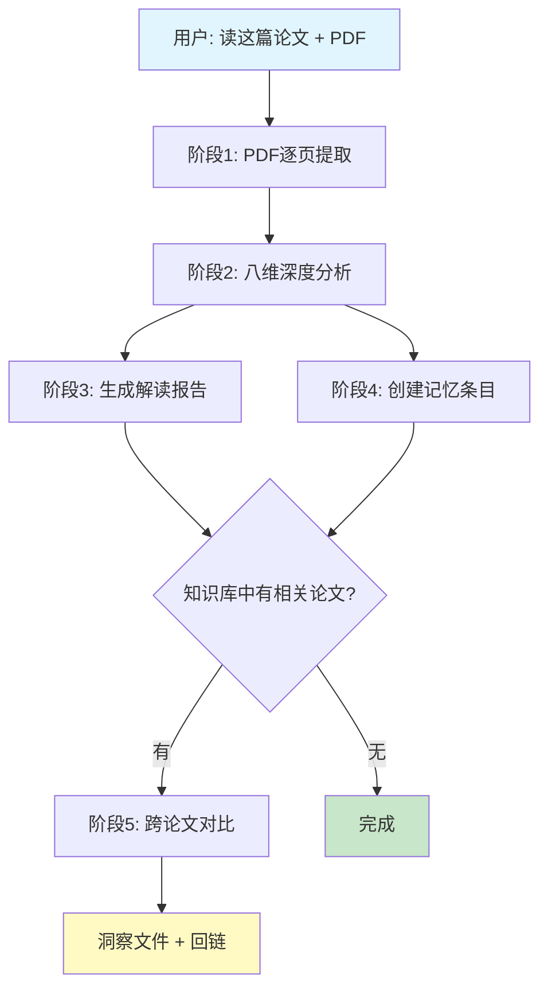

<p align="center">
  <h1 align="center">📖 Deep Read Paper Skill / 论文深度阅读技能</h1>
  <p align="center">
    基于 <a href="https://claude.ai/claude-code">Claude Code</a> 的学术论文深度阅读技能——持久化知识管理。
    <br/>
    <strong>读一次。记住所有。发现连接。</strong>
  </p>
</p>

<p align="center">
<a href="README.md">English</a> | 简体中文
<br/><br/>


</p>

---

## 这是什么？

**Deep Read Paper Skill** 将 Claude Code 转变为一个**个人 AI 研究助手**，能阅读、分析并记住学术论文。它不仅仅是 PDF 摘要器——而是一套完整的论文知识管理系统：

- 📄 **逐页阅读**论文 PDF，绝不跳过任何内容（含附录）
- 🧠 **八维深度分析**：5 个理解维度（问题溯源、方法溯源、通俗解读、实验分析、局限性）+ 3 个审稿人维度（新颖性审计、失败案例、拒稿风险）
- 📝 **生成**含 LaTeX 公式、数据表、声明-证据对照的结构化中文解读报告
- 💾 **记忆**到 Obsidian 兼容的知识库，含 YAML frontmatter、wikilinks 和 ChromaDB 向量索引
- 🔗 **自动关联**论文——发现方法相似/领域相通/互补关系
- 💡 **创新建议**：跨论文研究方向，含具体技术可行性分析

> **一句话**：指一下 PDF 说"读这篇论文"，剩下的一切自动完成。

---

## 为什么需要这个技能

| 痛点 | 解决方案 |
|------|----------|
| 读论文耗时，细节几天就忘 | 结构化双产出：详细解读报告 + 持久记忆条目 |
| 论文孤岛，看不到全局脉络 | Obsidian 知识图谱的跨论文关联 |
| LLM 摘要肤浅，缺少深度 | 八维分析：5 个理解维度 + 3 个审稿人维度 |
| 换项目就丢知识 | 可移植 Obsidian vault，独立于 Claude Code |
| 找不到三个月前读的论文 | ChromaDB 语义搜索 + 7 个 MCP 工具 |

---

## 工作流程



### 八维分析

| # | 维度 | 核心问题 |
|---|------|----------|
| 1 | **问题溯源** | 作者发现了什么问题？前人为什么没解决？突破口是什么？ |
| 2 | **方法溯源** | 原创还是改进？基座方法是什么？如何改变的？技术难度在哪？ |
| 3 | **通俗解读** | 用类比解释核心思想。输入输出规格。关键公式解读。 |
| 4 | **实验分析** | 声明-证据对照。基线选择理由。可复现性评估。 |
| 5 | **局限性分析** | 方法适用范围、实验盲区、诚实度评价、改进方向。 |

---

## 快速开始

### 前置条件

- **Claude Code**（启用 skills 功能）
- **Python 3.10+**
- **Obsidian**（可选——用于知识图谱可视化）
- **PyMuPDF** 支持 Linux/macOS/Windows

### 安装

```bash
# 1. 克隆并安装依赖
git clone https://github.com/huyang51/deep_read_paper_skill.git
cd deep_read_paper_skill
pip install -r requirements.txt

# 2. 编辑 settings.json（只需填写 3 个必填项）

# 3. 部署到你的项目
python setup.py

# 4. (可选) 初始化 Obsidian vault
cp -r vault-template/ /your/knowledge-base/path/

# 5. 重启 Claude Code
```

### 配置 (`settings.json`)

```json
{
  "vault_dir": "D:/my-papers/knowledge-base",
  "project_dir": "D:/my-papers",
  "python_cmd": "D:/Anaconda/python.exe",
  "embedding_model": "all-MiniLM-L6-v2"
}
```

| 字段 | 必填 | 说明 |
|------|------|------|
| `vault_dir` | ✅ | 知识库路径。报告、记忆条目和向量索引存储于此。 |
| `project_dir` | ✅ | Claude Code 项目根目录，`setup.py` 自动将配置部署至此。 |
| `python_cmd` | ✅ | Python 解释器路径（Windows 下建议用绝对路径）。 |
| `embedding_model` | 否 | 主要阅读中文论文时，建议设为 `paraphrase-multilingual-MiniLM-L12-v2`。 |
| `trigger_keywords_cn/en` | 否 | 自定义触发关键词（默认值覆盖常见模式）。 |

> **路径格式**：Windows 下请使用正斜杠 `/`（如 `D:/path/to/dir`）。
>
> **环境变量覆盖**：设置 `PAPER_KB_VAULT_DIR` 可覆盖 `vault_dir`，适合多项目共享同一 skill 安装。

---

## 使用方法

### 读论文

直接告诉 Claude Code 论文路径：

```
帮我读一下这篇论文："D:/papers/SayPlan - 2023 - Grounding LLMs using 3D Scene Graphs.pdf"
```

技能自动完成：
1. PyMuPDF 逐页提取（不跳过任何内容，含附录）
2. 八维深度分析
3. 生成中文解读报告 → `reports/<短名>_解读报告.md`
4. 创建结构化记忆条目 → `papers/<短名>.md`
5. ChromaDB 向量化索引
6. 如果知识库中有相关论文 → 跨论文对比 + 创建洞察文件

### 搜索知识库

直接在对话中提问：

```
"知识库里有什么关于 3D 场景图的论文？"
"搜索 RAG 相关的论文"
"对比一下 SayPlan 和 EmbodiedRAG"
```

可用的 MCP 工具：

| 工具 | 说明 |
|------|------|
| `paper_search` | 通过 ChromaDB 语义搜索（支持中英文） |
| `paper_get` | 按 ID 获取论文完整信息 |
| `paper_find_related` | 查找方法/领域/互补关联论文 |
| `paper_search_by_method` | 按方法类别检索 |
| `paper_index_stats` | 获取知识库统计信息 |

### 浏览知识图谱

用 Obsidian 打开 vault 目录：
- **图谱视图** (`Ctrl+G`)：论文为节点，箭头表示学术影响流（旧→新）
- **Dataview 插件**：`index.md` 提供动态可排序论文表格

---

## 架构

```
deep_read_paper_skill/
├── SKILL.md                     # Skill 定义（Claude Code 读取）
├── settings.json                # ⭐ 唯一需要编辑的配置文件
├── setup.py                     # 一键部署到你的项目
├── requirements.txt             # Python 依赖
│
├── mcp_server/                  # MCP Server（ChromaDB 向量索引 + 7 个工具）
│   ├── server.py                #   JSON-RPC 主循环 + 工具调度
│   ├── chroma_store.py          #   向量索引管理（增删改查）
│   ├── markdown_parser.py       #   YAML frontmatter 解析 + 自动回链
│   ├── cross_refs.py            #   跨论文关联发现
│   ├── config.py                #   读取 settings.json
│   └── models.py                #   Pydantic 输入输出模型
│
├── hooks/                       # Claude Code Hooks
│   ├── session_start.py         #   会话启动时注入最近论文摘要
│   └── user_prompt_submit.py    #   关键词检测 → 触发检索提示
│
├── tools/
│   └── index_paper.py           #   命令行论文索引工具
│
├── vault-template/              # Obsidian vault 模板
│   ├── .obsidian/               #   图谱 + 属性面板 + Dataview 预设
│   ├── index.md                 #   Dataview 动态索引
│   └── templates/               #   论文记忆和洞察模板
│
├── references/                  # 报告和记忆条目模板
│   ├── report_template.md
│   └── memory_entry_template.md
│
└── output/                      # setup.py 生成（自动部署）
```

### Vault 结构（用户数据）

```
<vault_dir>/
├── papers/          # 论文结构化记忆（.md 含 YAML + wikilinks）
├── reports/         # 完整中文解读报告
├── insights/        # 跨论文创新洞察（自动生成）
├── index.md         # Dataview 动态索引
└── .chromadb/       # 向量数据库（自动管理）
```

### 知识图谱约定

- **箭头方向**：旧论文 → 新论文（学术影响流向）
- **前向引用**（新论文 body 中）：使用**加粗文本**（`**SayPlan**`），不用 wikilink——避免反向图谱边
- **回链**（旧论文 body 中）：系统自动创建 `## 后续引用` 小节，含 `[[wikilink]]`
- **未入库论文/方法**：同样使用加粗文本，避免幽灵节点

---

## 产出示例

本技能已构建的知识库覆盖：

| 领域 | 论文 | 关联方式 |
|------|------|----------|
| 3D 场景图 + LLM 规划 | SayPlan (CoRL 2023), EmbodiedRAG (2024), Open3DSG (CVPR 2024), Text-Scene (2025), BrainBody-LLM (2025) | 3DSG 构建 → 检索 → 规划全栈 |
| 多模态检索 | FLMR, PreFLMR, ReT, UniIR, AgentKB | Late-interaction 检索范式演进 |

每篇论文报告包含：
- 顶部的 **30 秒速览卡片**
- **方法溯源表**——哪些设计来自哪篇前人工作
- **声明-证据对照**——论文的每个 claim 是否有实验支撑
- **跨论文对比**——方法/问题/实验维度差异一览
- **创新建议**——含具体技术可行性的改进方案

---

## Hooks

| Hook | 触发时机 | 行为 |
|------|----------|------|
| `SessionStart` | 新会话启动 | 注入最近 3 篇论文摘要 |
| `UserPromptSubmit` | 每次用户消息 | 关键词检测 → 注入检索提示 |

触发关键词可在 `settings.json` 中自定义，修改后即时生效。

---

## 常见问题

<details>
<summary><b>Q: Obsidian 图谱看不到节点？</b></summary>

1. 确认 Obsidian vault 路径与 `vault_dir` 一致
2. 图谱设置齿轮 → 确保"现有文件"开启
3. 检查是否有路径过滤器排除了 `papers/`
</details>

<details>
<summary><b>Q: MCP Server 启动失败？</b></summary>

```bash
# 快速依赖检查
python -c "import chromadb, watchfiles, frontmatter, pydantic; print('OK')"

# 手动测试
cd deep_read_paper_skill
echo '{"jsonrpc":"2.0","id":1,"method":"initialize","params":{}}' | python -m mcp_server
```
</details>

<details>
<summary><b>Q: 中文搜索结果不准确？</b></summary>

默认嵌入模型 `all-MiniLM-L6-v2` 主要优化英文。在 `settings.json` 中将 `embedding_model` 改为 `paraphrase-multilingual-MiniLM-L12-v2`，切换后需重建向量索引。
</details>

<details>
<summary><b>Q: PDF 文字提取失败（扫描版 PDF）？</b></summary>

PyMuPDF 无法从扫描/图片型 PDF 中提取文字。需先用 OCR 工具（如 Tesseract）预处理。
</details>

<details>
<summary><b>Q: 多台机器如何共享？</b></summary>

1. 将 skill 文件夹复制到每台机器
2. 更新各机器的 `settings.json` 路径
3. 运行 `python setup.py`
4. 用 Git 或共享盘同步 vault 目录
</details>

<details>
<summary><b>Q: 可以自定义分析维度吗？</b></summary>

可以——分析流程定义在 `SKILL.md` 中。修改 Phase 1-5 即可增删或重排分析维度，同步更新 `references/report_template.md` 中的报告模板。
</details>

---

## 依赖

| 包 | 版本 | 用途 |
|-----|------|------|
| `chromadb` | ≥0.4 | 语义搜索向量库 |
| `python-frontmatter` | ≥1.0 | YAML frontmatter 解析 |
| `pydantic` | ≥2.0 | MCP 工具 schema 校验 |
| `watchfiles` | ≥0.20 | 文件变化自动增量索引 |
| `PyMuPDF` | ≥1.23 | PDF 文本提取（由 Claude Code 直接调用） |

全部为纯 Python，在 Linux、macOS、Windows 上均可安装。

---

## 贡献

欢迎贡献的方向：

- **更好的 PDF 解析**：双栏论文、扫描版 PDF 回退、OCR 集成
- **更多语言**：英文、日文等语言的报告模板
- **新 MCP 工具**：引文图谱导出、BibTeX 生成
- **更多 LLM 后端**：支持 Claude 以外的模型

重大变更前请先提 issue 讨论。

---

## License

MIT — 详见 [LICENSE](LICENSE)。

---

## 致谢

- **Obsidian** — 图谱式知识管理范式
- **ChromaDB** — 轻量级本地向量检索
- **PyMuPDF** — 可靠的 PDF 文本提取
- 为 **Claude Code** 而生

---

<p align="center">
  <sub>致读了太多论文、记住了太少的研究者们 ❤️</sub>
</p>
