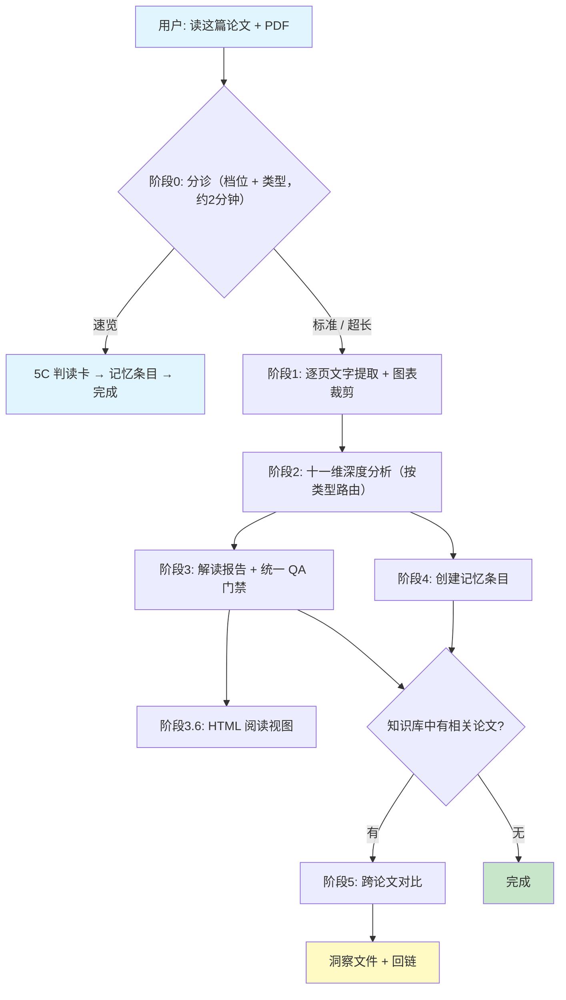

<p align="center">
  <h1 align="center">📖 Deep Read Paper Skill / 论文深度阅读技能</h1>
  <p align="center">
    基于 <a href="https://claude.ai/claude-code">Claude Code</a> 的学术论文深度阅读技能——持久化知识管理。
    <br/>
    <strong>读一次。记住所有。发现连接。</strong>
  </p>
</p>

<p align="center">
<a href="README.md">English</a> | 简体中文
<br/><br/>


</p>

---

## 这是什么？

**Deep Read Paper Skill** 将 Claude Code 转变为一个**个人 AI 研究助手**，能阅读、分析并记住学术论文。它不仅仅是 PDF 摘要器——而是一套完整的论文知识管理系统：

- 🎚️ **分诊档位**：2 分钟判定读取深度（速览/标准/超长）。**默认标准档**：单上下文一遍通读全文（1M 级窗口下普通论文无需多代理分读）+ 一道局外人 QA 门禁收尾；仅 60 页以上的技术报告/综述走**超长档编排**（3 组并行 + 跨视角矛盾仲裁）
- 📄 **逐页阅读**论文 PDF，绝不跳过任何内容（含附录）
- 🖼️ **图文双通道**：文字通道负责全文覆盖与数字溯源，视觉通道按 PDF 坐标几何裁剪图表、逐张视觉核验后嵌入报告——不再"只读文字不看图"
- 🖥️ **HTML 阅读视图**：每份定稿报告自动渲染为独立 HTML——公式三档交付（CDN 多镜像 → 单文件离线内嵌 → LaTeX 源码降级）、booktabs 三线表、侧边目录滚动高亮、图表点击放大、明暗双主题、打印友好；中英混排自动加薄空格——由 Markdown 确定性生成，可直接分享给合作者
- 🧠 **十一维深度分析**：5 个理解维度（问题溯源、方法溯源、通俗解读、实验分析、局限性）+ 3 个审稿人维度（新颖性审计、失败案例、拒稿风险）+ 3 个深度理解维度（反事实检验、隐含假设审计、综合判断）
- 🧭 **按类型路由**：分析前先判论文类型（方法/理论/综述/基准/系统/报告），再让十一维按类型变形——理论论文审证明结构（假设必要性、证明完整性），综述审覆盖度与分类轴，数据集审标注一致性与泄漏，系统审测法公平性。类型只改每个维度"问什么、拿什么当证据"，**不减少维度数，也不放松逐页全读**
- 📝 **生成**含 LaTeX 公式、数据表、声明-证据对照的结构化中文解读报告
- 💾 **记忆**到 Obsidian 兼容的知识库，含 YAML frontmatter、wikilinks 和 ChromaDB 向量索引
- 🔗 **关系结构化**——每条跨论文关系在 frontmatter 里声明类型（方法相似/问题相通/互补/发展）与方向（前身/后续/同期）；对方论文的互指条目、`related_papers` 投影、Obsidian 图谱边全部由声明推导，**箭头方向跟着数据走，不跟着阅读顺序走**（非时间顺序阅读不再需要手工搬边）
- ✅ **外部核验**——报告中关于其他论文的断言先经 OpenAlex/Semantic Scholar 验证（`cite_verify`），发表满 1 年的论文自动补"后验影响"（`paper_citations`）；核验不过就降级标注，杜绝张冠李戴。报告定稿前再由 `tools/verify_refs.py` 对正文点名的全部外部工作跑一遍**存在性门**，产出核验台账粘进 §6——含一条硬性诚实规则：**外部库未收录 ≠ 不存在**，查无记录绝不写成"伪造"
- 📊 **统计严谨性台账**——逐条盘比较类数字断言的统计支撑（种子/重复次数、检验方式与检验单元、Δ 与已报波动的量级、选择空间），缺口标 `[原文未交代]` 且**只当披露缺口**："论文没报"绝不写成"没做/不显著/复现失败"
- 💡 **创新建议**：跨论文研究方向，含具体技术可行性分析

> **一句话**：指一下 PDF 说"读这篇论文"，剩下的一切自动完成。

---

## 为什么需要这个技能

| 痛点 | 解决方案 |
|------|----------|
| 读论文耗时，细节几天就忘 | 结构化双产出：详细解读报告 + 持久记忆条目 |
| 论文孤岛，看不到全局脉络 | Obsidian 知识图谱的跨论文关联 |
| LLM 摘要肤浅，缺少深度 | 十一维分析：5 个理解维度 + 3 个审稿人维度 + 3 个深度理解维度；并按论文类型路由（理论/综述/基准/系统各有专门的问法） |
| 换项目就丢知识 | 可移植 Obsidian vault，独立于 Claude Code |
| 找不到三个月前读的论文 | ChromaDB 语义搜索 + 9 个 MCP 工具（含外部引用核验） |

---

## 工作流程


```mermaid
graph TD
    A["用户: 读这篇论文 + PDF"] --> T{"阶段0: 分诊（档位 + 类型，约2分钟）"}
    T -->|"速览"| Q["5C 判读卡 → 记忆条目 → 完成"]
    T -->|"标准 / 超长"| B["阶段1: 逐页文字提取 + 图表裁剪"]
    B --> C["阶段2: 十一维深度分析（按类型路由）"]
    C --> D["阶段3: 解读报告 + 统一 QA 门禁"]
    C --> E["阶段4: 创建记忆条目"]
    D --> R["阶段3.6: HTML 阅读视图"]
    D --> F{"知识库中有相关论文?"}
    E --> F
    F -->|"有"| G["阶段5: 跨论文对比"]
    F -->|"无"| H["完成"]
    G --> I["洞察文件 + 回链"]

    style A fill:#e1f5fe
    style Q fill:#e1f5fe
    style H fill:#c8e6c9
    style I fill:#fff9c4
```

### 十一维分析

| # | 类别 | 维度 | 核心问题 |
|---|------|------|----------|
| 1 | 读者理解 | **问题溯源** | 作者发现了什么问题？前人为什么没解决？突破口是什么？ |
| 2 | 读者理解 | **方法溯源** | 原创还是改进？基座方法是什么？如何改变的？技术难度在哪？ |
| 3 | 读者理解 | **通俗解读** | 用类比解释核心思想。输入输出规格。关键公式解读。 |
| 4 | 读者理解 | **实验分析** | 声明-证据对照。基线选择理由。可复现性评估。 |
| 5 | 读者理解 | **局限性分析** | 方法适用范围、实验盲区、诚实度评价、改进方向。 |
| 6 | 审稿人 | **新颖性审计** | 增量/重要/突破？声称-实质对照？与同期工作定位？ |
| 7 | 审稿人 | **失败案例与边界** | 核心假设清单？作者未展示的失效模式？跨域泛化空白？ |
| 8 | 审稿人 | **拒稿风险** | 审稿人最可能引用的拒稿理由？Top-3 严重度排序 + rebuttal 方案？ |
| 9 | 深度理解 | **反事实检验** | 每条核心论断在什么条件下会失效？数据/规模/基线替换？ |
| 10 | 深度理解 | **隐含假设审计** | 论文依赖哪些未明说的假设（数据/评估/工程）？是否验证？ |
| 11 | 深度理解 | **综合判断** | 把所有"判定"汇总为可操作的"行动地图"——下一步该从哪个角度切入？ |

> **按类型路由**：分析前先判论文类型（方法/理论/综述/基准/系统/报告），再按类型调整各维度的问题对象——理论论文的"实验设计"变为**证明结构审计**（假设必要性、证明完整性）、"消融"变为假设松弛分析；综述的"方法溯源"变为**谱系重建**、"实验设计"变为**覆盖度审计**（检索式、分类轴是否 MECE）；数据集论文审标注一致性与泄漏；系统论文审测法公平性。类型**只改每个维度问什么，不减少维度数**，也不放松逐页全读（细则见 `SKILL.md` Phase 2『类型路由』）。

---

## 快速开始

### 前置条件

- **Claude Code**（启用 skills 功能）
- **Python 3.10+**
- **Obsidian**（可选——用于知识图谱可视化）
- **PyMuPDF** 支持 Linux/macOS/Windows

### 安装

> ⚠️ **强烈建议**：在独立的 Conda 环境中安装，避免与本地其他 Python 项目依赖冲突。

```bash
# 1. 克隆仓库
git clone https://github.com/huyang51/deep_read_paper_skill.git
cd deep_read_paper_skill

# 2. 创建并激活 Conda 环境（每台机器只需做一次）
conda create -n paper-kb python=3.10 -y
conda activate paper-kb

# 3. 在激活的 conda 环境中安装 skill（一次性装齐全部依赖）
pip install -e .

# 4. 由模板创建并编辑 settings.json（填写 3 个必填项）
cp settings.example.json settings.json
# - vault_dir:   存储报告和记忆条目的目录
# - project_dir: 你的 Claude Code 项目根目录
# - python_cmd:  conda 环境中 python 的**绝对路径**，例如
#                - Linux/Mac:  "$(conda info --base)/envs/paper-kb/bin/python"
#                - Windows:    "%USERPROFILE%\anaconda3\envs\paper-kb\python.exe"
#                在激活的 conda 环境中执行 `which python`（Linux/Mac）
#                或 `where python`（Windows）可获取该路径。

# 5. 部署到你的项目（仍在 conda 环境中）
paper-kb-deploy            # 或：python deploy.py

# 6. （可选）初始化 Obsidian vault
cp -r vault-template/ /your/knowledge-base/path/

# 7. 重启 Claude Code
```

> **💡 为什么要用 Conda 环境**：
> - 将 `chromadb` / `pydantic` / `PyMuPDF` 等依赖与系统 Python 及其他项目隔离
> - 升级 / 卸载本 skill 时不会影响其他项目
> - 跨机器复现：只需 `pip freeze > requirements.txt` + `pip install -r requirements.txt`

> **常见坑**：
> - 忘记 `conda activate paper-kb` → `pip install` 装到了系统 Python，hooks 报 `ModuleNotFoundError`
> - `settings.json` 中 `python_cmd` 指向系统 Python 而非 conda 环境 → 同样的报错
> - 解决：在激活的 conda 环境中执行 `which python`（Linux/Mac）或 `where python`（Windows），将绝对路径填入 `python_cmd`

### 配置 (`settings.json`)

```json
{
  "vault_dir": "D:/my-papers/knowledge-base",
  "project_dir": "D:/my-papers",
  "python_cmd": "D:/Anaconda3/envs/paper-kb/python.exe",
  "embedding_model": "paraphrase-multilingual-MiniLM-L12-v2",
  "trigger_keywords_cn": ["论文", "文献", "paper", "paper reading", "深度阅读", "论文解读", "论文分析", "读论文"],
  "trigger_keywords_en": ["paper", "literature", "deep read", "paper reading", "paper analysis"]
}
```

| 字段 | 必填 | 说明 |
|------|------|------|
| `vault_dir` | ✅ | 知识库路径。报告、记忆条目和向量索引存储于此。 |
| `project_dir` | ✅ | Claude Code 项目根目录，`paper-kb-deploy` 自动将配置部署至此。 |
| `python_cmd` | ✅ | **conda 环境中 python 的绝对路径**（如 Windows: `D:/Anaconda3/envs/paper-kb/python.exe`；Linux/Mac: `/opt/anaconda3/envs/paper-kb/bin/python`）。在激活的 conda 环境中执行 `which python` / `where python` 即可获取。 |
| `embedding_model` | 否 | **默认: `paraphrase-multilingual-MiniLM-L12-v2`**（中英文双语，走 SentenceTransformer → **需要 torch**，首次使用要下载模型）。若环境里没有 torch，改用 `all-MiniLM-L6-v2`——它走 ChromaDB 自带的 ONNX 嵌入，**不需要 torch 也不用另外下载**，代价是中文语义检索变弱。**换模型等于换向量空间**：已有 `.chromadb` 里的向量与新模型不可比，需删库重建索引。`deploy.py` 会用 `python_cmd` 做一次启动自检，缺包会直接告警。 |
| `openalex_mailto` | 否 | OpenAlex 礼貌池邮箱（提升 `cite_verify`/`paper_citations` 限流额度），可选但建议填 |
| `trigger_keywords_cn` | 否 | 自动触发论文相关搜索提示的中文关键词（UserPromptSubmit hook）。 |
| `trigger_keywords_en` | 否 | 自动触发论文相关搜索提示的英文关键词（UserPromptSubmit hook）。 |

> **路径格式**：Windows 下请使用正斜杠 `/`（如 `D:/path/to/dir`）。
>
> **环境变量覆盖**：设置 `PAPER_KB_VAULT_DIR` 可覆盖 `vault_dir`，适合多项目共享同一 skill 安装。

---

## 使用方法

### 读论文

直接告诉 Claude Code 论文路径：

```
帮我读一下这篇论文："D:/papers/SayPlan - 2023 - Grounding LLMs using 3D Scene Graphs.pdf"
```

技能自动完成：
1. 分诊（约 2 分钟，Keshav 第一遍法）：判定速览 / 标准 / 超长三档，速览档止于 5C 判读卡
2. PyMuPDF 逐页提取（不跳过任何内容，含附录）
3. 按 PDF 对象坐标几何裁剪图表为高清 PNG，逐张视觉核验后嵌入报告核心图速览
4. 单上下文一遍通读完成十一维深度分析（超长档：3 组并行 + 矛盾检测与仲裁）
5. 通过统一 QA 门禁（局外人代理：事实抽查 + 可读性五问）后生成中文解读报告 → `reports/<短名>_解读报告.md`
6. 在同目录渲染配套 HTML 阅读视图（阶段 3.6）——`.md` 始终是唯一事实源，改完重渲染即可
7. 创建结构化记忆条目 → `papers/<短名>.md`（记录 read_mode 档位）
8. ChromaDB 向量化索引
9. 如果知识库中有相关论文 → 跨论文对比 + 创建洞察文件

### 分享报告：HTML 阅读视图

HTML 渲染是自动的；编辑 md 后手动重渲染：

```bash
python tools/render_report.py --md "<vault>/reports/ReT_解读报告.md"
```

| 参数 | 作用 |
|------|------|
| *（默认）* | KaTeX 0.16.11 走 CDN，四镜像按序回退（jsDelivr → npmmirror → staticfile → unpkg）；某个镜像被墙自动换下一个，全部失败则公式降级为可读的 LaTeX 源码 |
| `--fetch-katex` | 一次性把 KaTeX（JS/CSS/字体）下载到本地缓存 |
| `--embed-katex` | 把缓存中的 KaTeX 内嵌进 HTML——单文件自包含，断网也能正常打开 |
| `--katex-dir DIR` | 指定本地 KaTeX `dist/` 目录替代缓存 |
| `--offline` | 完全不加载 KaTeX（公式保留为可读 LaTeX 源码） |
| `--out FILE` | 输出到别处（默认与 `.md` 同目录同名） |

缓存位置：Windows 为 `%LOCALAPPDATA%\deep-read-paper`，Linux/macOS 为 `~/.cache/deep-read-paper`，可用 `DEEP_READ_CACHE` 覆盖。图片是 `../attachments/` 相对路径、交互 JS 全部内联——除 CDN 档的 KaTeX 外，阅读视图不依赖网络。

### 搜索知识库

直接在对话中提问：

```
"知识库里有什么关于 3D 场景图的论文？"
"搜索 RAG 相关的论文"
"对比一下 SayPlan 和 EmbodiedRAG"
```

可用的 MCP 工具：

| 工具 | 说明 |
|------|------|
| `paper_search` | 通过 ChromaDB 语义搜索（支持中英文） |
| `paper_get` | 按 ID 获取论文完整信息 |
| `paper_find_related` | 查找关联论文——已声明关系优先，其次旧 `related_papers`，再次关键词推断候选（每条结果带 `source` / `relation_type` / `direction`） |
| `paper_search_by_method` | 按方法类别检索 |
| `paper_index_stats` | 获取知识库统计信息 |
| `paper_index` | 创建/更新论文结构化条目，含 `relations` 声明（写入侧，由流程调用，通常无需手写）；同步互指条目与图谱边 |
| `paper_remove` | 从知识库与向量索引中删除一篇论文 |
| `cite_verify` | 核验"关于其他论文"的断言是否存在（OpenAlex/S2，反幻觉） |
| `paper_citations` | 论文外部引用脉络：被引数、Top 施引工作（后验影响）、参考文献列表 |

### 浏览知识图谱

用 Obsidian 打开 vault 目录：
- **图谱视图** (`Ctrl+G`)：论文为节点，箭头表示学术影响流（旧→新）
- **Dataview 插件**：`index.md` 提供动态可排序论文表格

---

## 架构

```
deep_read_paper_skill/
├── SKILL.md                     # Skill 定义（Claude Code 读取）
├── settings.json                # ⭐ 唯一需要编辑的配置文件（由 settings.example.json 复制）
├── settings.example.json        # 上项模板（随仓库分发）
├── pyproject.toml               # 打包元数据（`pip install -e .`）
├── deploy.py                    # 一键部署到你的项目（`paper-kb-deploy`）
├── requirements.txt             # Python 依赖
│
├── mcp_server/                  # MCP Server（ChromaDB 向量索引 + 9 个工具）
│   ├── server.py                #   JSON-RPC 主循环 + 工具调度
│   ├── chroma_store.py          #   向量索引管理（增删改查）
│   ├── markdown_parser.py       #   YAML frontmatter + 关系同步（互指条目、投影、图谱边）
│   ├── relations.py             #   关系规则层：类型/方向词表、互指、校验
│   ├── cross_refs.py            #   跨论文关联发现
│   ├── config.py                #   读取 settings.json
│   ├── models.py                #   Pydantic 输入输出模型
│   └── cite_api.py              #   OpenAlex/Semantic Scholar 外部核验客户端
│
├── hooks/                       # Claude Code Hooks
│   ├── session_start.py         #   会话启动时注入最近论文摘要
│   └── user_prompt_submit.py    #   关键词检测 → 触发检索提示
│
├── tools/
│   ├── index_paper.py           #   命令行论文索引工具
│   ├── extract_figures.py       #   几何裁剪图片提取（视觉通道）
│   ├── render_report.py         #   md 报告 → 独立 HTML 阅读视图（KaTeX CDN / 缓存 / 内嵌三档）
│   ├── verify_refs.py           #   点名外部工作的批量存在性门（§6 核验台账）
│   ├── verify_graph_arrows.py   #   图谱体检：关系完整性 + 箭头方向 + 正文依据
│   └── migrate_relations.py     #   旧 vault → 结构化 relations（默认只出计划）
│
├── vault-template/              # Obsidian vault 模板
│   ├── .obsidian/               #   图谱 + 属性面板 + Dataview 预设
│   ├── index.md                 #   Dataview 动态索引
│   └── templates/               #   论文记忆和洞察模板
│
├── references/                  # 报告、记忆与编排模板
│   ├── report_template.md
│   ├── memory_entry_template.md
│   ├── orchestration_prompts.md #   阶段2 多代理任务卡（超长档）+ 统一 QA 卡
│   └── quickcard_template.md    #   速览档 5C 判读卡
│
└── output/                      # deploy.py 生成（自动部署）
```

### Vault 结构（用户数据）

```
<vault_dir>/
├── papers/          # 论文结构化记忆（.md 含 YAML + wikilinks）
├── reports/         # 完整中文报告（.md + 自动渲染的同名 .html 阅读视图，嵌入原图）
├── insights/        # 跨论文创新洞察（自动生成）
├── attachments/     # 每篇论文的图表裁剪（<short_name>/*.png + manifest.json）
├── index.md         # Dataview 动态索引
└── .chromadb/       # 向量数据库（自动管理）
```

### 知识图谱约定

- **`relations` 是唯一事实源**：每条关系声明 `target` / `type` / `direction` / `note`，`direction` 相对本文（`predecessor` = 对方更早，`successor` = 对方更晚，`peer` = 同期并行）
- **其余一切都是推导出来的**：对方论文的互指条目、双方 `related_papers` 投影、`## 后续引用` 图谱边，都在索引时自动写入——声明关系就是全部工作
- **箭头方向**：旧论文 → 新论文（学术影响流向）。同步按声明方向落边，非时间顺序阅读无需手工修正；`peer` 关系不产生边
- **正文引用**：使用**加粗文本**（`**SayPlan**`），不用 wikilink——手写 wikilink 会造成重复边或反向边
- **未入库论文/方法**：同样使用加粗文本，避免幽灵节点
- **旧 vault**：`python tools/migrate_relations.py` 出计划（不写盘），`--apply` 落盘；`python tools/verify_graph_arrows.py` 体检关系完整性、箭头方向与正文依据

---

## 产出示例

本技能已构建的知识库覆盖：

| 领域 | 论文 | 关联方式 |
|------|------|----------|
| 3D 场景图 + LLM 规划 | SayPlan (CoRL 2023), EmbodiedRAG (2024), Open3DSG (CVPR 2024), Text-Scene (2025), BrainBody-LLM (2025) | 3DSG 构建 → 检索 → 规划全栈 |
| 多模态检索 | FLMR, PreFLMR, ReT, UniIR, AgentKB | Late-interaction 检索范式演进 |

每篇论文报告包含：
- 与 md 同目录的 **独立 HTML 阅读视图**
- 顶部的 **30 秒速览卡片**
- **方法溯源表**——哪些设计来自哪篇前人工作
- **声明-证据对照**——论文的每个 claim 是否有实验支撑
- **跨论文对比**——方法/问题/实验维度差异一览
- **创新建议**——含具体技术可行性的改进方案

---

## Hooks

| Hook | 触发时机 | 行为 |
|------|----------|------|
| `SessionStart` | 新会话启动 | 注入最近 3 篇论文摘要 |
| `UserPromptSubmit` | 每次用户消息 | 关键词检测 → 注入检索提示 |

触发关键词可在 `settings.json` 中自定义，修改后即时生效。

---

## 常见问题

<details>
<summary><b>Q: Obsidian 图谱看不到节点？</b></summary>

1. 确认 Obsidian vault 路径与 `vault_dir` 一致
2. 图谱设置齿轮 → 确保"现有文件"开启
3. 检查是否有路径过滤器排除了 `papers/`
</details>

<details>
<summary><b>Q: MCP Server 启动失败？</b></summary>

```bash
# 快速依赖检查
python -c "import chromadb, watchfiles, frontmatter, pydantic; print('OK')"

# 手动测试
cd deep_read_paper_skill
echo '{"jsonrpc":"2.0","id":1,"method":"initialize","params":{}}' | python -m mcp_server
```
</details>

<details>
<summary><b>Q: 中文搜索结果不准确？</b></summary>

默认嵌入模型 `paraphrase-multilingual-MiniLM-L12-v2` 同时支持中英文。如果你之前用的是旧版默认 `all-MiniLM-L6-v2`（仅优化英文），请在 `settings.json` 中改回 `paraphrase-multilingual-MiniLM-L12-v2`，然后重建向量索引。
</details>

<details>
<summary><b>Q: PDF 文字提取失败（扫描版 PDF）？</b></summary>

PyMuPDF 无法从扫描/图片型 PDF 中提取文字。需先用 OCR 工具（如 Tesseract）预处理。
</details>

<details>
<summary><b>Q: 多台机器如何共享？</b></summary>

1. 将 skill 文件夹复制到每台机器
2. 更新各机器的 `settings.json` 路径
3. 运行 `paper-kb-deploy`
4. 用 Git 或共享盘同步 vault 目录
</details>

<details>
<summary><b>Q: HTML 报告里公式显示成 LaTeX 源码？</b></summary>

KaTeX 默认走 CDN 并四镜像回退；若机器断网或所有镜像都被拦截，公式会降级为可读的 LaTeX 源码（不显示 `$` 噪声），页面也会给出提示。想要完全离线的单文件：

```bash
# 一次性：把 KaTeX 下载到本地缓存
python tools/render_report.py --fetch-katex
# 之后渲染时内嵌 KaTeX（约 700KB，断网可开）
python tools/render_report.py --md "<报告>.md" --embed-katex
```

`--offline` 则相反：主动不加载 KaTeX，只保留 LaTeX 源码。
</details>

<details>
<summary><b>Q: 可以自定义分析维度吗？</b></summary>

可以——分析流程定义在 `SKILL.md` 中。修改 Phase 0-5 即可增删或重排分析维度，同步更新 `references/report_template.md` 中的报告模板（其中"渲染器认识的结构"一节决定 HTML 阅读视图能否正确排版）与 SKILL Phase 2『类型路由』表（增删维度后，各类型的"变化维度"列需同步）。
</details>

---

## 依赖

| 包 | 版本 | 用途 |
|-----|------|------|
| `chromadb` | ≥0.4 | 语义搜索向量库 |
| `python-frontmatter` | ≥1.0 | YAML frontmatter 解析 |
| `pydantic` | ≥2.0 | MCP 工具 schema 校验 |
| `watchfiles` | ≥0.20 | 文件变化自动增量索引 |
| `PyMuPDF` | ≥1.23 | PDF 文本提取（由 Claude Code 直接调用） |
| `sentence-transformers` | ≥2.2 | 多语言 embedding 模型（默认）的加载后端，ChromaDB embedding function 依赖；用 `all-MiniLM-L6-v2` 时不需要（走 ChromaDB 自带 ONNX，仍需 `onnxruntime`，随 chromadb 安装） |
| `markdown` | ≥3.4 | md → HTML 阅读视图渲染（`tools/render_report.py`）；KaTeX 走 CDN 或可选的本地缓存，无需 LaTeX 工具链 |

全部为纯 Python，在 Linux、macOS、Windows 上均可安装。

---

## 贡献

欢迎贡献的方向：

- **更好的 PDF 解析**：双栏论文、扫描版 PDF 回退、OCR 集成
- **更多语言**：英文、日文等语言的报告模板
- **新 MCP 工具**：引文图谱导出、BibTeX 生成
- **更多 LLM 后端**：支持 Claude 以外的模型

重大变更前请先提 issue 讨论。

---

## License

MIT — 详见 [LICENSE](LICENSE)。

---

## 致谢

- **Obsidian** — 图谱式知识管理范式
- **ChromaDB** — 轻量级本地向量检索
- **PyMuPDF** — 可靠的 PDF 文本提取
- 为 **Claude Code** 而生

---

<p align="center">
  <sub>致读了太多论文、记住了太少的研究者们 ❤️</sub>
</p>
